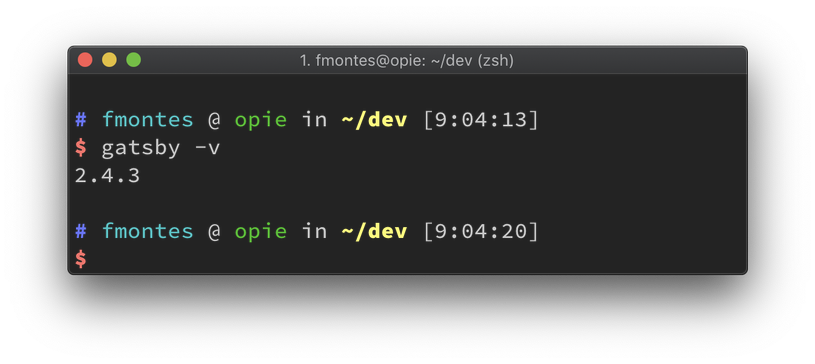
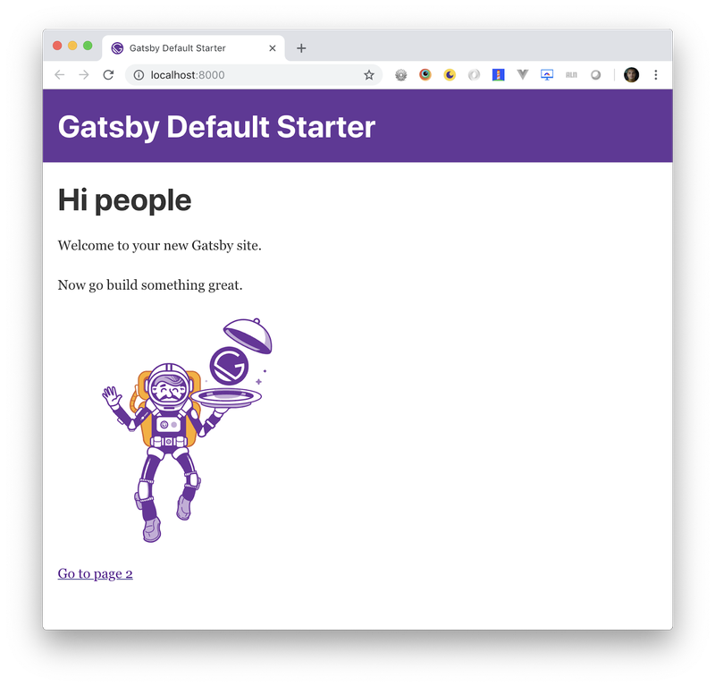
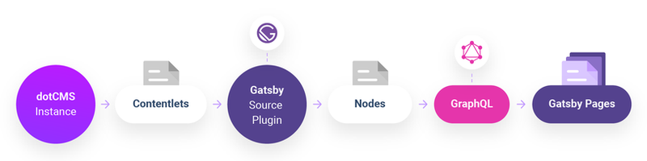
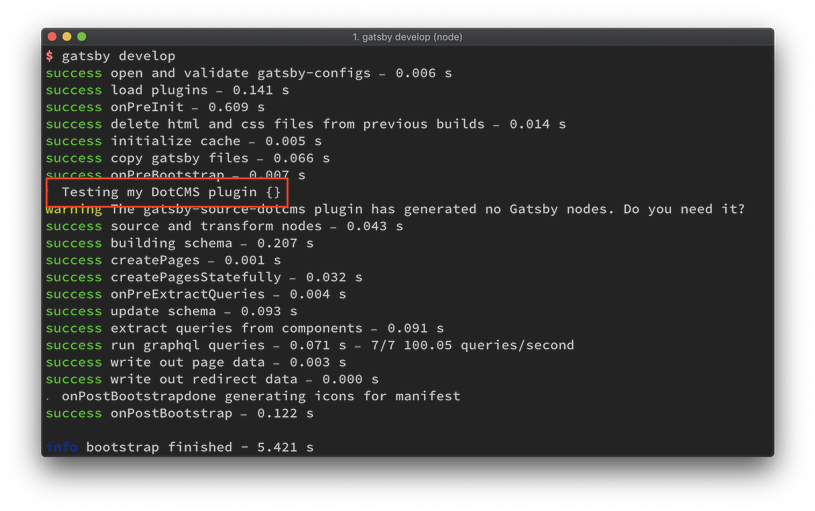
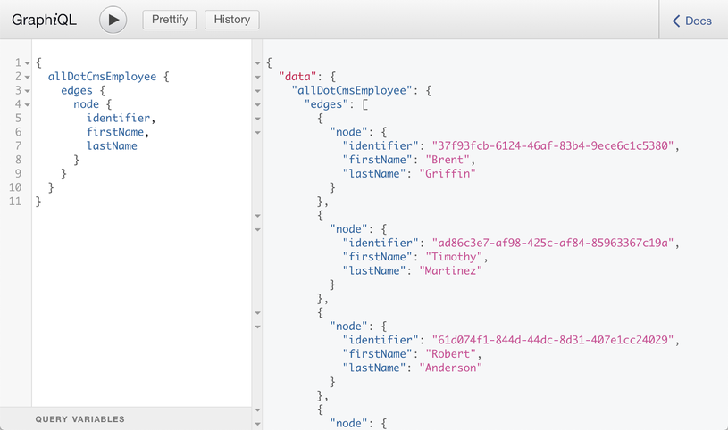
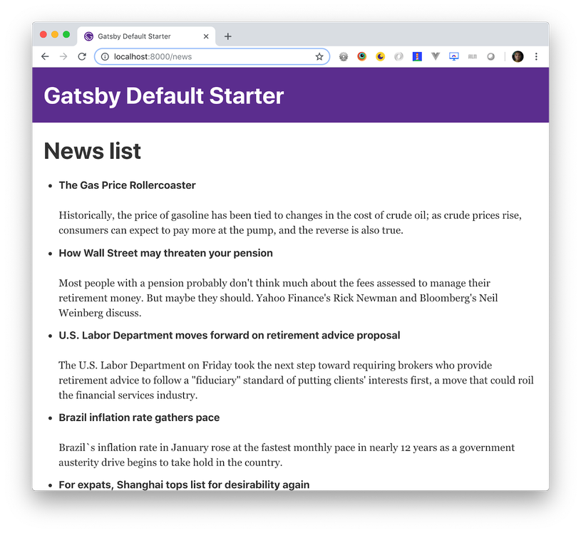
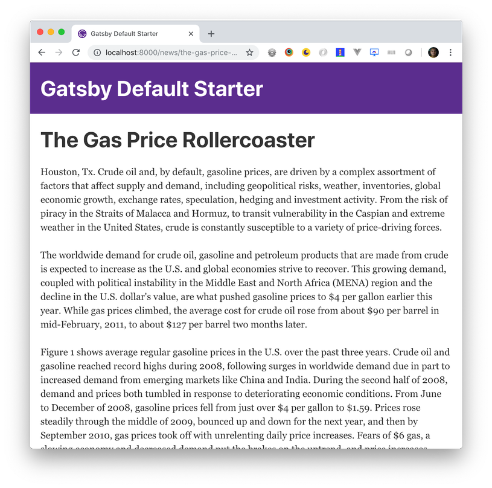

If you're looking to launch a small, static, and speedy website, micro-site, or landing page, you may be considering a static-site generator like Gatsby.

This article will walk you through the process of using Gatsby alongside dotCMS, a Java-based open-source headless CMS, to build a static website that uses API calls to pull content that's created, stored, and managed in dotCMS, and presented by Gatsby.

## What You Need:

1. [Node.js and NPM](https://nodejs.org/en/)
2. [React.js](https://reactjs.org/) knowledge
3. [GraphQL](https://graphql.org/) knowledge (not required but you are going to use it. You can copy + paste)

## What is Gatsby?

Gatsby defines themselves as "a blazing fast modern site generator for React" and yes, the generated sites are fast out of the box.

Gatsby's rich data plugin ecosystem lets you build sites with the data you want from one or many sources: Pull data from headless CMSs (like [dotCMS](https://dotcms.com)), SaaS services, APIs (like the [dotCMS content API](https://dotcms.com/docs/latest/content-api)) and the allows you to bring the data into your page using [GraphQL](https://graphql.org/).

## Static-Site Generator Benefits

### Security

No databases and the code injection threat is close to none.

### Reliability

You can serve HTML files everywhere.

### Speed

Regular static sites are fast (again no database or backend) and with Gatsby + React they are even faster.

### Scalability

No need for complexity on the server as static websites with HTML files can be easily scaled up by just increasing the bandwidth.

## Static-Site Generator Limitations

Fetching data for a Gatsby site happens at build time, meaning that if new content is created in dotCMS, it will be not available into your site until the next build, or the next time you "run" your static-site generator CMS which is Gatsby in today's case.

### But... There Are Solutions for This Too

1. You can create a cronjob that runs every _n_ minutes to build and deploy your site.
2. [Hybrid app pages](https://www.gatsbyjs.org/docs/building-apps-with-gatsby/#hybrid-app-pages) to the rescue! Remember Gatsby have React.js in his core which means you can make network request to APIs and get new data into your components.

## How to Create a Gatsby Site

### Install Gatsby

Gatsby have this amazing CLI tool to create, manage and run Gatsby projects, to install it, go to your terminal and run:

```bash
$ npm install --global gatsby-cli
```

If everything went well, you can type:

```bash
$ gatsby -v
```

And get 2.4.3 or a similar version:



## Create a Gatsby Site

Now let's use the Gatsby CLI tool to create a site:

```bash
$ gatsby new dotcms-site
```

Note: You can replace "dotcms-site" with the name you want for your project.

### The command you just ran:

1. Created a new site with the Gatsby default starter.
2. Created a folder with the name of the project (dotcms-site).
3. Install all the npm packages that needs to run the site.
4. Made your life easier!

### Let's Run Our New Gatsby Site:

```bash
$ cd dotcms-site
```

Browse into the folder of your project.

```bash
$ gatsby develop
```

This command starts a development server. You will be able to see and interact with your new site in a development environment. Also, it has live reload, so any changes you do in your files you can see immediately in your site.

Now open a browser and go to _http://localhost:8000_ and if everything went well you should something like:



## To Get Data, You Need a Source Plugin

Gatsby has a plugin system, in order to get data you need what they call a "Source Plugin." Source plugins "source" data from remote or local locations into what Gatsby calls [nodes](https://www.gatsbyjs.org/docs/node-interface/).

Think of a node as the exact equivalent of a [contentlet in dotCMS](https://dotcms.com/docs/latest/content). So if you are showing products, every product object you pull from your headless CMS is a Gatsby node.

You're going to write a Gatsby source plugin that fetches all the contentlets in a dotCMS instance and turns them into Gatsby nodes that you can later display in our pages by querying with GraphQL.



Before you start, if you would like to read more about Gatsby Source plugin their [documentation](https://www.gatsbyjs.org/docs/create-source-plugin/) and [tutorial](https://www.gatsbyjs.org/docs/source-plugin-tutorial/) are really good.

### Create gatsby-source-dotcms Plugin

The bare essentials of a plugin are: directory named after your plugin, which contains a package.json file and a gatsby-node.js file:

```
|-- plugins
|-- gatsby-source-dotcms
    |-- gatsby-node.js
        |-- package.json
```

Start by creating the directory and changing into it:

```bash
$ mkdir plugins
$ mkdir plugins/gatsby-source-dotcms
$ cd plugins/gatsby-source-dotcms
```

#### Create a package.json File

Now create a package.json file. This describes your plugin and any third-party code it might depend on. npm has a command to create this file for you. Run

```bash
$ npm init --yes
```

to create the file using default options.

NOTE: You can omit `--yes` if you'd like to specify the options yourself.

With the set up done, move on to adding the plugin's functionality.

#### Create a gatsby-node.js File

Create a new file called gatsby-node.js in your gatsby-source-dotcms directory. Open the file in your favorite code editor and add the following:

```javascript
exports.sourceNodes = ({ actions, createNodeId, createContentDigest }, configOptions) => {
    const { createNode } = actions
    // Gatsby adds a configOption that's not needed for this plugin, delete it
    delete configOptions.plugins

    // plugin code goes here...
    console.log('Testing my DotCMS plugin', configOptions)
}
```

#### What Did You Do by Adding This Code?

You implemented Gatsby's sourceNodes API which Gatsby will run as part of its bootstrap process. When Gatsby calls sourceNodes, it'll pass in some helper functions (actions, createNodeId, and createContentDigest) along with any config options that are provided in your project's `gatsby-config.js` file:

```javascript
exports.sourceNodes = ({ actions, createNodeId, createContentDigest }, configOptions) => {...}
```

You do some initial setup:

```javascript
const { createNode } = actions

// Gatsby adds a configOption that's not needed for this plugin, delete it
delete configOptions.plugins
```

And finally add a placeholder message:

```javascript
console.log('Testing my DotCMS plugin', configOptions)
```

## How to Add the dotCMS Plugin to Your Gatsby Site

The skeleton of your plugin is in place, which means you can add it to your project and check your progress so far.

Open `gatsby-config.js` from the root directory of your tutorial site, and add the gatsby-source-dotcms plugin:

```javascript
module.exports = {
    siteMetadata: {
        title: 'Gatsby Default Starter',
    },

    plugins: [
        {
            resolve: 'gatsby-source-dotcms',
            options: {},
        },
    ],
}
```

Open a new terminal in the root directory of your tutorial site, then start Gatsby's development mode:

```bash
$ gatsby develop
```

Check the lines after success on PreBootstrap; you should see your "Testing my plugin" message along with an empty object from the options your `gatsby-config.js` file:



Note that Gatsby is warning you that your plugin is not generating any Gatsby nodes. Time to fix that.

### Getting the Data From DotCMS

Like I mentioned before, you need to get ALL the contentlets from the dotCMS instance and turn them into Gatsby nodes.

#### The Action Plan

In order to create a GraphQL node that you can query by content type, you need two things from dotCMS:

1.  The contentlet.
2.  The content type of each contentlet.

In [dotCMS](https://dotcms.com/), you need to use the new [content types REST endpoint](https://dotcms.com/docs/latest/content-type-api) to get all the content types variables and then use the Content API endpoint to get all the contentlets for each content type in the instance.

You'll combine the results from the two requests together to create a big collection of contentlets with an extra property of contentType.

#### Add Dependencies

From your plugin folder (/plugins/gatsby-source-dotcms) run:

```bash
$ npm install node-fetch --save
```

Open your package.json file and you'll see node-fetch have been added to a dependencies section at the end:

```json
"dependencies": {
    "node-fetch": "^2.2.0"
}
```

[node-fetch](https://github.com/bitinn/node-fetch) is a light-weight module that brings [window.fetch](https://developer.mozilla.org/en-US/docs/Web/API/Fetch_API) to Node.js so you can use fetch to do the request to dotCMS endpoints.

#### Create a dotCMS JavaScript Library

To create the dotCMS library to get all the contentlets and content types you going to use:

1. [ES6 Classes](https://developer.mozilla.org/en-US/docs/Web/JavaScript/Reference/Classes)
2. [Promise](https://developer.mozilla.org/en-US/docs/Web/JavaScript/Reference/Global_Objects/Promise)
3. [Async](https://developer.mozilla.org/en-US/docs/Web/JavaScript/Reference/Statements/async_function)/[Await](https://developer.mozilla.org/en-US/docs/Web/JavaScript/Reference/Operators/await)

I'm assuming that you are familiar with these technologies, so I'm not going to explain how they work in this tutorial in too much detail.

To begin, create a dotcms-api.js file inside the /plugins/gatsby-source-dotcms folder, open the file, and add the following code:

```javascript
const fetch = require('node-fetch')

class DotCMSApi {
    constructor(options) {
        this.options = options
    }

    getBaseUrl() {
        return `${this.options.host.protocol}://${this.options.host.url}`
    }

    getContentletsByContentType(contentType) {
        const getUrl = () => {
            return `${this.getBaseUrl()}/api/content/render/false/query/+contentType:${contentType}%20+(conhost:${this.options.host.identifier}%20conhost:SYSTEM_HOST)%20+languageId:1%20+deleted:false%20+working:true/orderby/modDate%20desc`
        }

        return fetch(getUrl())
            .then((data) => data.json())
            .then((data) => data.contentlets)
            .then((contentlets) => {
                contentlets.forEach((contentlet) => {
                    contentlet.contentType = contentType
                })
                return contentlets
            })
    }

    async getContentTypesVariables() {
        const getUrl = () => {
            return `${this.getBaseUrl()}/api/v1/contenttype?per_page=100`
        }

        return fetch(getUrl(), {
            headers: {
                DOTAUTH: Buffer.from(
                    `${this.options.credentials.email}:${this.options.credentials.password}`
                ).toString('base64'),
            },
        })
            .then((data) => data.json())
            .then((contentTypes) => contentTypes.entity.map((contentType) => contentType.variable))
    }

    async getData() {
        const contentlets = await this.getContentTypesVariables().then((variables) => {
            return variables.map(async (variable) => {
                const data = await this.getContentletsByContentType(variable)
                return data
            })
        })
        return Promise.all(contentlets)
    }
}

exports.getContentlets = async (configOptions) => {
    const dotCMSApi = new DotCMSApi(configOptions)

    return dotCMSApi.getData().then((contentTypesContentlets) => {
        // Flatten nested array
        return [].concat.apply([], contentTypesContentlets)
    })
}
```

#### What is all this code doing?

```javascript
const fetch = require('node-fetch')
```

You imported the npm module, node-fetch, and it will be used to do the requests to the dotCMS instance and get the data you need.

```javascript
class DotCMSLibrary {
    constructor(options) {
        this.options = options
    }
}
```

Then you created a class that contains the methods you use to get the data you need (contentlets and content types). When you create an instance of this class you pass the options that you'll add to the `gatsby-config.js` file.

```javascript
getBaseUrl() {
    return `${this.options.host.protocol}://${this.options.host.url}`
}
```

These simple methods are use to get the dotCMS instance URL.

```javascript
getContentletsByContentType(contentType) {
    const getUrl = () => {
        return `${this.getBaseUrl()}/api/content/render/false/query/+contentType:${contentType}%20+(conhost:${this.options.host.identifier}%20conhost:SYSTEM_HOST)%20+languageId:1%20+deleted:false%20+working:true/orderby/modDate%20desc`;
    };

    return fetch(getUrl())
        .then((data) => data.json())
        .then((data) => data.contentlets)
        .then((contentlets) => {
            contentlets.forEach((contentlet) => {
                contentlet.contentType = contentType;
            });
            return contentlets;
        });
}
```

In this method, you do the request to get all the contentlets of the specific content type you'll pass as a parameter, and to each contentlet you add the `contentType` property that will be used to query data. This method is called several times, once for each content type in the dotCMS instance.

```javascript
async getContentTypesVariables() {
    const getUrl = () => {
        return `${this.getBaseUrl()}/api/v1/contenttype?per_page=100`;
    };

    return fetch(getUrl(), {
        headers: {
            DOTAUTH: Buffer.from(
                `${this.options.credentials.email}:${this.options.credentials.password}`
            ).toString('base64')
        }
    })
        .then((data) => data.json())
        .then((contentTypes) => contentTypes.entity.map((contentType) => contentType.variable));
}
```

This method will get an array of content type variables using the new Content Types API and then map the result to an array of variables.

NOTE: make sure you pass the query param per_page=100 at the URL with the full amount (or more) of content types in your instance.

```javascript
async getData() {
    const contentlets = await this.getContentTypesVariables().then((variables) => {
        return variables.map(async (variable) => {
            const data = await this.getContentletsByContentType(variable);
            return data;
        });
    });
    return Promise.all(contentlets);
}
```

And finally you used `getContentTypesVariables` and `getContentletsByContentType` to get all the contentlets in the dotCMS instance. First, you get an array of content types variables and for each one of them you do a request to the dotCMS Content API to get the all contentlets for each content type. Remember that this code runs on build time which means it not going to be a performance issue doing so many requests.

The constant contentlets results in an array of Promises of contentlets so you have to use `Promise.all` to return a single Promise that resolves when all of the contentlet promises have resolved.

```javascript
exports.getContentlets = async (configOptions) => {
    const dotCMSApi = new DotCMSApi(configOptions)

    return dotCMSApi.getData().then((contentTypesContentlets) => {
        // Flatten nested array
        return [].concat.apply([], contentTypesContentlets)
    })
}
```

Finally, you export one method from this library, where you initialize the DotCMS API with the config options from the `gatsby-config.js` file get all the contentlets in the dotCMS instance and flatten it into one big collection of contentlets with an extra property of content type. The result will be like:

```json
[
    {
        "contentType": "newsItem",
        "owner": "dotcms.org.1",
        "identifier": "f60ed48b-1f5f-4a7b-b4b0-f5a857b41e6a",
        "inode": "734944ff-6f02-4337-b9fe-aef3c372dad8",
        "title": "This is a new item",
        "expire": "2020-01-02 02:19:00.0",
        "tags": "oil,investment,gas,prices,retiree:persona"
    },
    {...}
]
```

The appended `contentType` property in this collection of contentlets is key, because we'll be using that to do our GraphQL queries.

## Writing the Gatsby Plugin

Open the `/gatsby-source-dotcms/gatsby-node.js` file and replace the code with the following:

```javascript
const dotCMSApi = require('./dotcms-api');

exports.sourceNodes = ({ actions, createNodeId }, configOptions) => {
    const { createNode } = actions;

    // Gatsby adds a configOption that's not needed for this plugin, delete it
    delete configOptions.plugins;

    // Helper function that processes a contentlet to match Gatsby's node structure
    const processContentlet = (contentlet) => {
        const nodeId = createNodeId('dotcms-${contentlet.contentType}-${contentlet.inode}');
        const nodeContent = JSON.stringify(contentlet);
        const nodeData = {
            ...contentlet,
            id: nodeId,
            parent: null,
            children: [],
            internal: {
                type: 'DotCMS${contentlet.contentType}',
                content: nodeContent,
                contentDigest: JSON.stringify(contentlet)
            }
        };
        return nodeData;
    };

    // Gatsby expects sourceNodes to return a promise
    return dotCMSApi
        .getContentlets(configOptions)
        .then((contentlets) => {
            // Process the response data into a node
            contentlets.forEach((contentlet) => {
                // Process each contentlet data to match the structure of a Gatsby node
                const nodeData = processContentlet(contentlet);
                // Use Gatsby's createNode helper to create a node from the node data
                createNode(nodeData);
            });
        });
};

```

Let's go over the new code.

```javascript
const dotCMSApi = require('./dotcms-api');
```

First of all, you imported the dotCMS API you created.

```javascript
const processContentlet = (contentlet) => {
    const nodeId = createNodeId('dotcms-${contentlet.contentType}-${contentlet.inode}');
    const nodeContent = JSON.stringify(contentlet);
    const nodeData = {
        ...contentlet,
        id: nodeId,
        parent: null,
        children: [],
        internal: {
            type: `DotCMS${contentlet.contentType}`,
            content: nodeContent,
            contentDigest: JSON.stringify(contentlet)
        }
    };
    return nodeData;
};
```

The job of this function is to receive a dotCMS contentlet and return a [Gatsby Node](https://www.gatsbyjs.org/docs/node-interface/) by extending it with a [spread operator](https://developer.mozilla.org/en-US/docs/Web/JavaScript/Reference/Operators/Spread_syntax). The basic node structure looks like:

```typescript
interface BasicNode {
    id: String;
    children: Array[String];
    parent: String;
    // Reserved for plugins who wish to extend other nodes.
    fields: Object;
    internal: {
        contentDigest: String;
        // Optional media type (https://en.wikipedia.org/wiki/Media_type) to indicate
        // to transformer plugins this node has data they can further process.
        mediaType: String;
        // A globally unique node type chosen by the plugin owner.
        type: String;
        // The plugin which created this node.
        owner: String;
        // Stores which plugins created which fields.
        fieldOwners: Object;
        // Optional field exposing the raw content for this node
        // that transformer plugins can take and further process.
        content: String;
        //...other fields specific to this type of node
    };
}
```

#### Gatsby expects sourceNodes to return a promise

```javascript
return dotCMSApi
    .getContentlets(configOptions)
    .then((contentlets) => {
        // Process the response data into a node
        contentlets.forEach((contentlet) => {
            // Process each contentlet data to match the structure of a Gatsby node
            const nodeData = processContentlet(contentlet);
            // Use Gatsby's createNode helper to create a node from the node data
            createNode(nodeData);
        });
    });

```

The final piece of the puzzle is to return a Promise of processed Gatsby nodes. You used the dotCMSApi library to `getContentlets` and convert each one of those contentlets you got into a node.

## Trying Our Fancy New Plugin

Edit your `gatsby-config.js` and update the entry for gatsby-source-dotcms:

```javascript
{
    resolve: 'gatsby-source-dotcms',
    options: {
        host: {
            protocol: 'http',
            url: 'localhost: 8080',
            identifier: '48190c8c-42c4-46af-8d1a-0cd5db894797'
        },
        credentials: {
            email: 'admin@dotcms.com',
            password: 'admin'
        }
    }
};
```

NOTE: This configuration is set for a dotCMS instance running in localhost:8080, make sure you point this values to an actual running dotCMS instance.

Now, from the root of your project, run the following in your terminal:

```
$ gatsby develop
```

If everything went well you should see:


### Querying DotCMS Data With GraphQL

Every time you run `$ gatsby develop` you get this:

If you go to http://localhost:8000/___graphql_ in your browser, you will get a web app that allows you to run [GraphQL](https://graphql.org/) queries and make sure all DotCMS content is there. It will look like this:



## How to Generate Pages

Note: As I mentioned before, Gatsby use [React.js](https://reactjs.org/) to build pages and components. Is this tutorial, I am assuming you are familiar with this library*.*

So you have all our dotCMS content ready to use. Let's create some pages.

You can create pages in Gatsby explicitly by defining React components in src/pages/, or programmatically by using the createPages API.

### Create a News Listing Page

By default, Gatsby creates a `src/pages/page-2.js` file. Let's rename that file to `src/pages/news.js` and then replace the code with:

```javascript
import React from 'react';
import { Link } from 'gatsby';
import Layout from '../components/layout';

const NewsPage = () => (
    <Layout>
        <h1>News list</h1>
        <p>Here we will show a news list</p>
        <Link to="/">Go back to the homepage</Link>
    </Layout>
);

export default NewsPage;
```

This is very simple React.js code you just created a component that will print out plain HTML.

To see this page, go to your terminal and run:

`$ gatsby develop`

And then open your browser to _http://localhost:8000/news_ and you should see:


### Bring the dotCMS Contentlets

Okay, now is a good time to use the source plugin you built before. You're going to query all the contentlets of the content type "News" and put them in the page.

Once again, edit `src/pages/news.js` and add the following code:

```javascript
import React from 'react';
import { graphql } from 'gatsby';
import Layout from '../components/layout';

const NewsPage = ({ data }) => (
    <Layout>
        <h1>News list</h1>
        <ul class="news">
            {data.allDotCmsNews.edges.map(({ node }, index) => (
                <li key={index}>
                    <h4>{node.title}</h4>

                    <p>{node.lead}</p>
                </li>
            ))}
        </ul>
    </Layout>
);

export const query = graphql`
    query {
        allDotCmsNews {
            edges {
                node {
                    lead
                    title
                    urlTitle
                }
            }
        }
    }
`;

export default NewsPage;

```

Let's go over this new code.

```javascript
import { graphql } from 'gatsby'
```

You need to import GraphQL so you can use it to query the contentlets. Gatsby's GraphQL [tag](https://www.gatsbyjs.org/docs/page-query#how-does-the-graphql-tag-work) enables page components to retrieve data via a GraphQL query.

```javascript
const NewsPage = ({ data }) => (
    <Layout>
        <h1>News list</h1>

        <ul class="news">
            {data.allDotCmsNews.edges.map(({ node }, index) => (
                <li key={index}>
                    <h4>{node.title}</h4>

                    <p>{node.lead}</p>
                </li>
            ))}
        </ul>
    </Layout>
);
```

Finally, you just print out the data you get from the GraphQL query.

```javascript
export const query = graphql`
    query {
        allDotCmsNews {
            edges {
                node {
                    lead
                    title
                    urlTitle
                }
            }
        }
    }
`;
```

Here, the "magic" of getting the data to happen is a simple GraphQL query to get all the dotCMS News items. In this case, you asked for the field: lead, title, and urlTitle. If everything went well, you should see something like:



### Creating News Detail Pages

You have a list of news, now let's create a detail page for each news item in dotCMS. I know that's sound like a ton of work, but with Gatsby you can programmatically create pages from data: basically, you can tell Gatsby, here is a collection of news, create a page for each item using this template (another React component).

Edit your `gatsby-node.js` file and add the following code:

```javascript
const path = require('path');

exports.createPages = ({ graphql, actions }) => {
    const { createPage } = actions;

    return new Promise((resolve, reject) => {
        graphql(`
            {
                allDotCmsNews {
                    edges {
                        node {
                            inode

                            lead

                            sysPublishDate

                            title

                            urlTitle
                        }
                    }
                }
            }
        `).then((result) => {
            result.data.allDotCmsNews.edges.forEach(({ node }) => {
                createPage({
                    path: 'news/${node.urlTitle}',
                    component: path.resolve('./src/templates/news-item.js'),
                    context: {
                        // Data passed to context is available
                        // in page queries as GraphQL variables.
                        slug: node.urlTitle
                    }
                });
            });

            resolve();
        });
    });
};

```

What is this code doing?

First, at all, this code will be running at build time, all these pages will be generated once when you build Gatsby, so if new a contentlet is added to dotCMS, you need to build and deploy your Gatsby site in order to get that content.

```javascript
const path = require(`path`)
```

This is the implementation of the `createPages` API which Gatsby calls so plugins can add pages. By exporting createPages from a gatsby-node.js file, you're saying, "at this point in the bootstrapping sequence, run this code.

```javascript
graphql(`
    {
        allDotCmsNews {
            edges {
                node {
                    inode
                    lead
                    sysPublishDate
                    title
                    urlTitle
                }
            }
        }
    }
`);
```

The same as you did with the listing page, here is another GraphQL query to get all the dotCMS news contentlets, the only difference is that you're asking for more fields.

```javascript
.then((result) => {
    result.data.allDotCmsNews.edges.forEach(({ node }) => {
        createPage({
            path: `news/${node.urlTitle}`,
            component: path.resolve('./src/templates/news-item.js'),
            context: {
                // Data passed to context is available
                // in page queries as GraphQL variables.
                slug: node.urlTitle
            }
        });
    });
    resolve();
});
```

Once the GraphQL query resolves, you have access to all the news items, and you can iterate over and create a page for each item; but you need to pass an object to the `createPage` function:

1.  path: the URL where the generated page will be created. In this case, it will be news/page-url-title. You use the `urlTitle` field from the contentlet to create the path, but, whatever you use, needs to be unique, because this will be the name of the HTML generated file and thus the URL of the page.
2.  component: this is where you tell Gatsby which template you will be using to create each page (you will create this in the next step).
3.  context: this is an object that you are passing to the GraphQL query that will be in the template component.

Finally, you call `resolve()` for the Promise returning in the implementation of the `createPages` function.

### Creating the Template

A template is just a regular React.js component, so let's create a file in `src/templates/news-item.js` (like you set in the path property of the createPage param) and add the following code:

```javascript
import React from 'react'
import { graphql } from 'gatsby'
import Layout from '../components/layout'

export default ({ data }) => {
    const post = data.allDotCmsNews.edges[0].node
    return (
        <Layout>
            <h1>{post.title}</h1>
            <div dangerouslySetInnerHTML={{ __html: post.story }} />
        </Layout>
    )
}

export const query = graphql`
    query($slug: String!) {
        allDotCmsNews(filter: { urlTitle: { eq: $slug } }) {
            edges {
                node {
                    title,
                    story,
                }
            }
        }
    }
`
```

Let's go over this code

```javascript
export default ({ data }) => {
```

Before you get the data to use in the page, you get it as a prop in the component.

```html
<Layout>
 <h1>{post.title}</h1>
 <div dangerouslySetInnerHTML={{ __html: post.story }} />
</Layout>
```

You print out the content of the news item on the page.

```javascript
export const query = graphql`
    query($slug: String!) {
        allDotCmsNews(filter: { urlTitle: { eq: $slug } }) {
            edges {
                node {
                    title,
                    story,
                }
            }
        }
    }
`
```

Here is in the GraphQL query. Everything is almost the same as the other queries with the difference that you're matching one news item by `urlTitle` and the `$slug` param, which is what you pass in the context object in the params of the `createPage` function in the gatsby-node.js

Now we can build our pages, we just need to run:

```bash
$ gatsby develop
```

Right now you don't have links to the recently created links, but you can use the `urlTitle` field from the contentlet. Go to: _http://localhost:8080/news/the-gas-price-rollercoaster_ and you should see:



## Final Touches: Adding Links to Our Listing Page

Go and edit `src/pages/news.js` and:

Import the [Link](https://www.gatsbyjs.org/docs/linking-between-pages/) component on the top of the file:

```javascript
import { Link } from 'gatsby'
```

Replace this line:

```html
<h4>{node.title}</h4>
```

With:

```javascript
<h4><Link to={'news/' + node.urlTitle}>{node.title}</Link></h4>
```

In the browser go to _http://localhost:8080/news_ and you should see:


Now the news list items are linked to the detail page you dynamically created with Gatsby.

## Static-Site Generator + Headless CMS = The Perfect Match

And there you have it! You've now used a static-site generator and a headless CMS to build a static website. This is just one example of how these two technologies can combine.

To recap, we built a Gatsby Source Plugin from scratch, created a listing page, and created a bunch of static HTML pages querying dotCMS data with GraphQL.

I recommend you take a look [Gatsby Documentation](https://www.gatsbyjs.org/docs/), this is the very basic but you can do so much more, styled components, layouts, pagination, etc.
