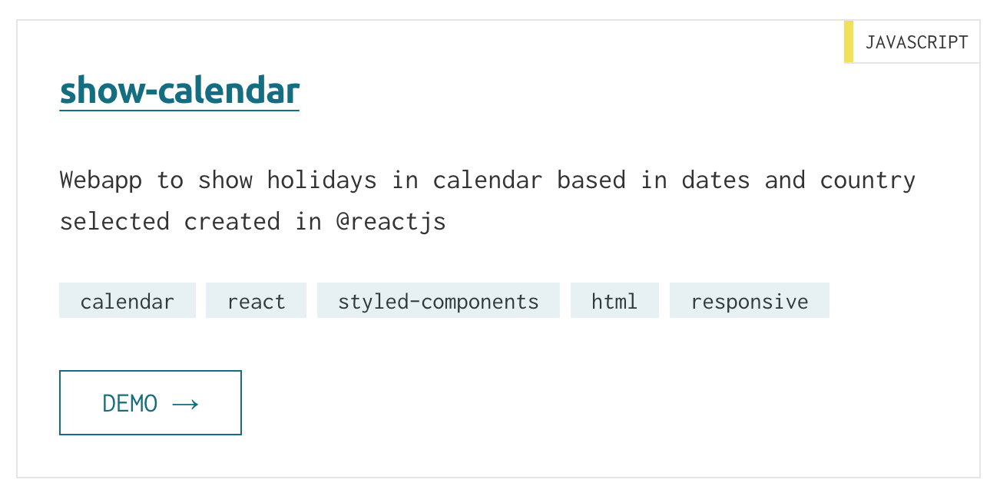

My personal site needs some love for a while now, [the last commit on it was on Apr 3, 2016](https://github.com/fmontes/fmontes/commit/23fd6abd645d9afb67497528c933672c9624431a). So I need a new site and I need it fast and that's exactly where Gatsby helps me.

## What I want
1. Blazing fast site
2. Easy to publish a blog post with code highlights
3. Showcase specific GitHub repos
4. Scalable and easy to keep updated

## Create a Gatsby site

You only need two commands:

```shell
npm install -g gatsby-cli
gatsby new my-blog-starter https://github.com/gatsbyjs/gatsby-starter-blog.
```

With Gatsby you can startup a site in no time. Since it has the concept of [starters](https://www.gatsbyjs.org/starters/) you can pick from hundreds the one that matches your project, in my case it was [gatsby-starter-blog](https://www.gatsbyjs.org/starters/gatsbyjs/gatsby-starter-blog/).

## gatsby-starter-blog

This starter has some important plugins installed, so out of the box I got:

1. [Blog post with markdown files](https://www.gatsbyjs.org/packages/gatsby-transformer-remark/)
2. [Offline support](https://www.gatsbyjs.org/packages/gatsby-plugin-offline)
3. [Progressive Web App ready](https://www.gatsbyjs.org/packages/gatsby-plugin-manifest/)
4. [SEO enhancements](https://www.gatsbyjs.org/packages/gatsby-plugin-react-helmet/)
5. [Responsive images](https://www.gatsbyjs.org/packages/gatsby-image/)
6. [Google Analytics](https://www.gatsbyjs.org/packages/gatsby-plugin-google-analytics/)
7. [Vertical rhythm typography](https://www.gatsbyjs.org/docs/typography-js/)
8. [prismjs](https://prismjs.com/) for code syntax highlight

## What I add
1. [Styled components](https://www.gatsbyjs.org/docs/styled-components/)
2. Lazy load image inside markdown files with [gatsby-remark-lazy-load](https://www.gatsbyjs.org/packages/gatsby-remark-lazy-load/) and [lazines](https://www.npmjs.com/package/lazysizes) **(this is a must for performance)**.
99. Github Repo Showcase with [gatsby-source-github-api](https://www.gatsbyjs.org/packages/gatsby-source-github-api) and this GraphQL Query:
```graphql
    {
        search(query: "fmonteslab user:fmontes", type: REPOSITORY, first: 100) {
            edges {
                node {
                    ... on Repository {
                        name
                        url
                        homepageUrl
                        description
                        createdAt
                        pushedAt
                        primaryLanguage {
                            id
                            name
                        }
                        repositoryTopics(first: 100) {
                            edges {
                                node {
                                    topic {
                                        name
                                    }
                                }
                            }
                        }
                    }
                }
            }
        }
    }
```

## Deploy to Netlify
Netlify is one of the best (if not the best) place to deploy your Gatsby site. And is super easy to do, just follow [this steps](https://www.gatsbyjs.org/docs/deploying-to-netlify/).

## What I got

### Fast site
Gatsby takes care of everything, cache, minification, lazy load your images, etc. I had to do some work to improve SEO, like hit areas and aria-labels in some buttons for better score:


### Blog posts easy to publish
I just need to create a markdown file in my `/content/blog` folder, commit, push and Netlify will deploy the site with the new post.

### My GitHub repos
When I tag one of my repos with `#fmonteslab` I redeploy my site and will be published.



### Scalable
With Gatsby I can create new pages, pull content from everywhere, in conclusion, add content and feature really easy.

## More to come
1. SEO work
2. Post post and post more
3. Connect with Linked In API to create a dynamic resume
4. Sky is the limit

## Conclusion
I'm very happy with the results of my site, I'll keep it updated and get. Go and check the code: https://github.com/fmontes/fmontes-gatsby, fork it, use it, build your own.