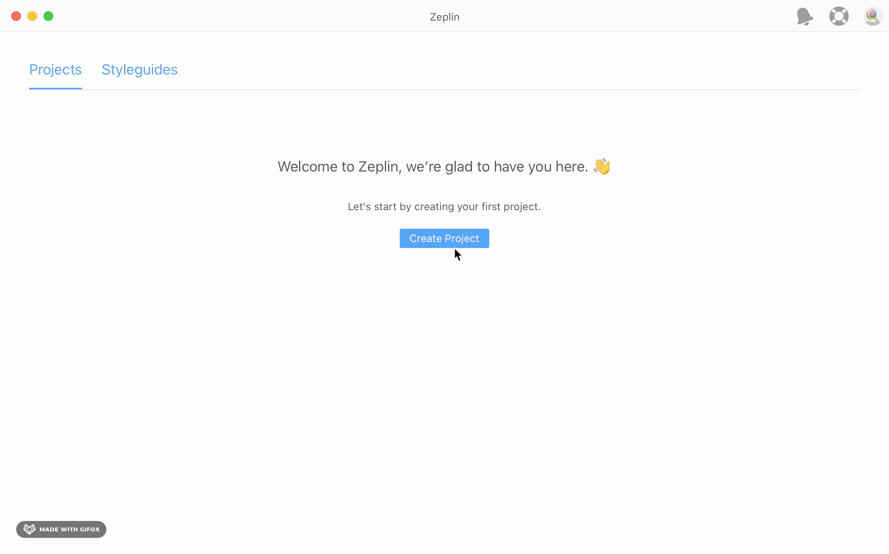
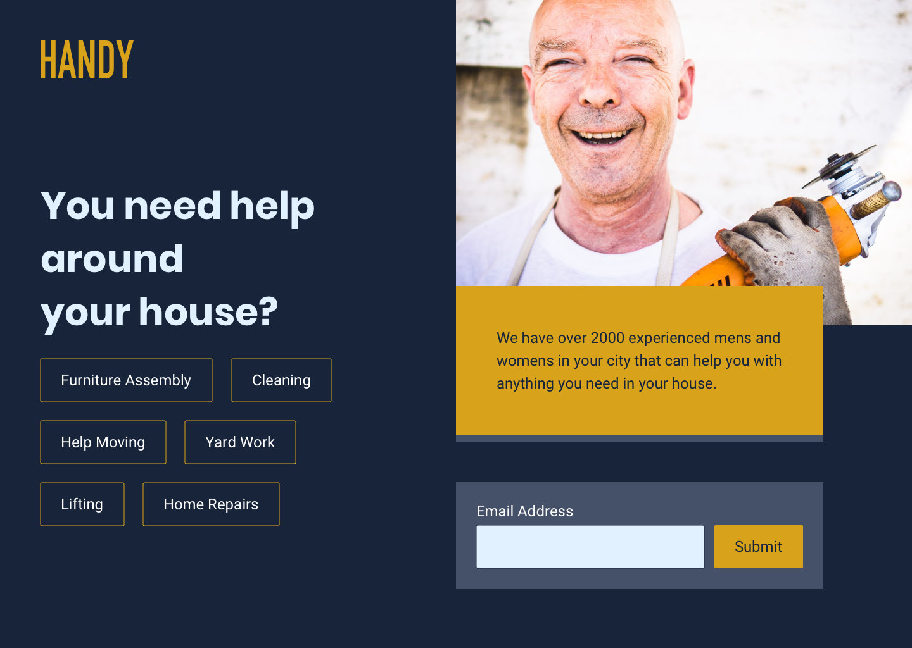
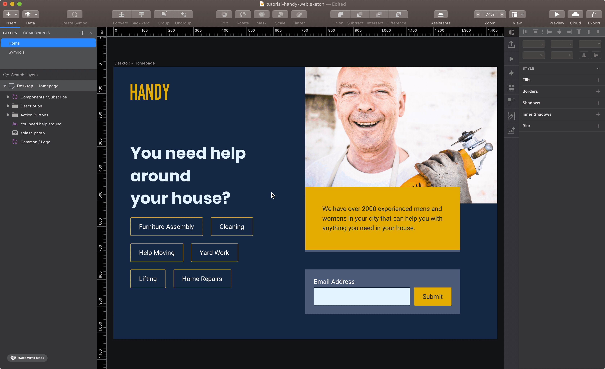
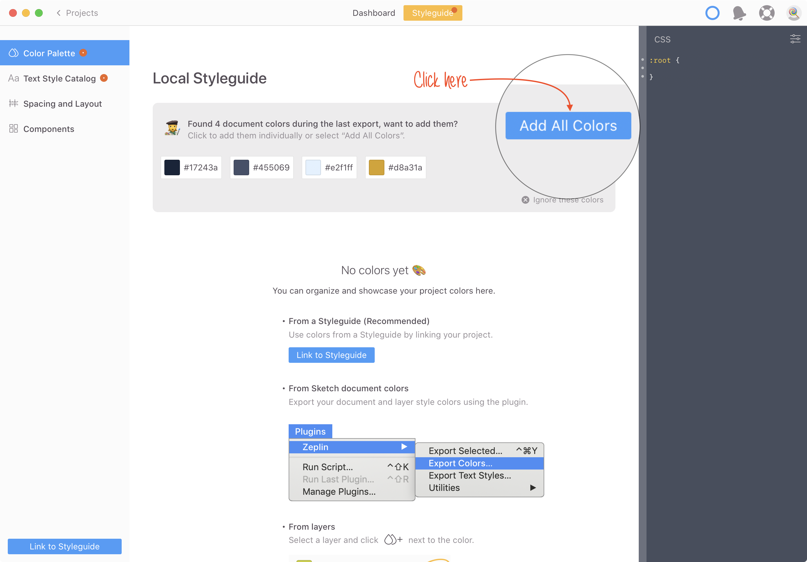
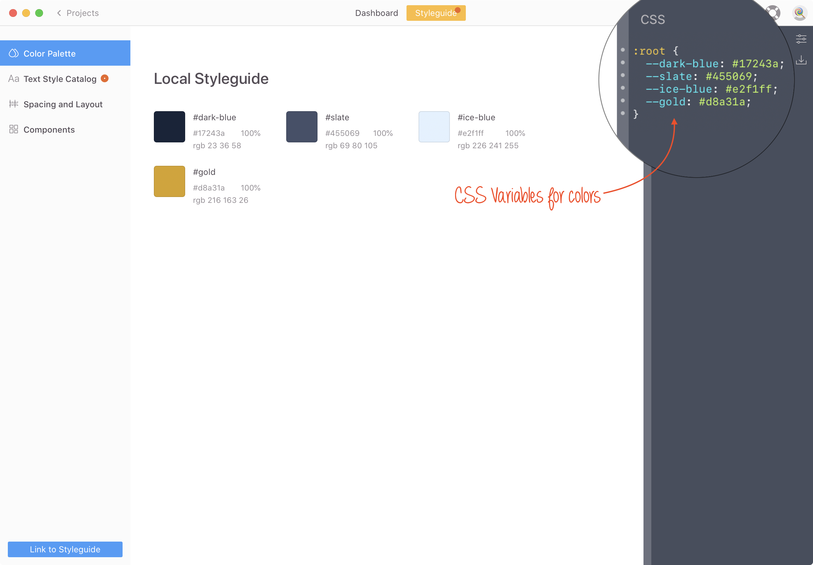
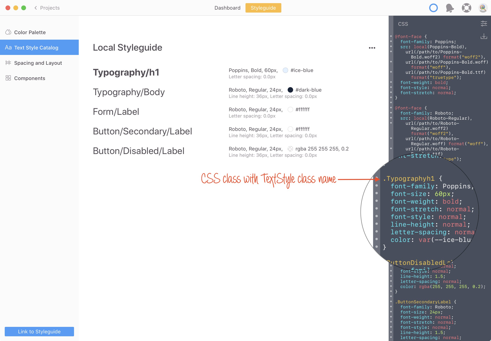
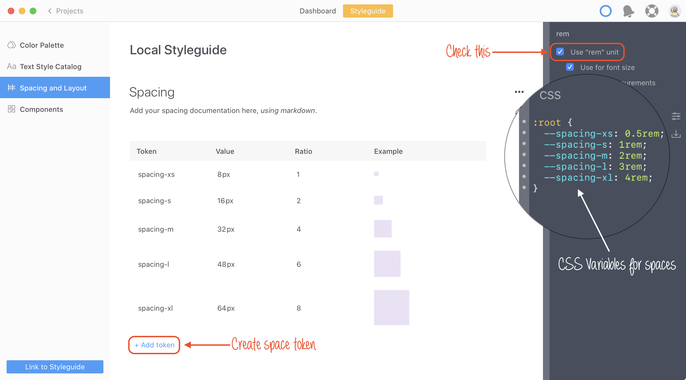
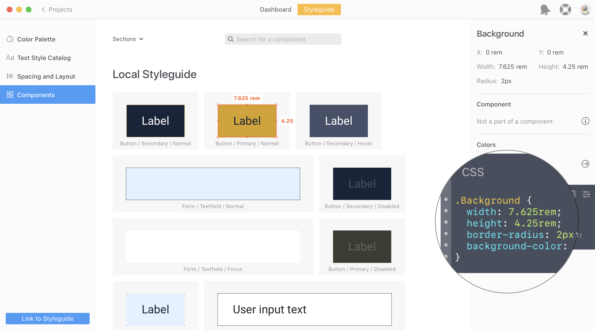

Delivering interface designs to developers is not an easy task, many designers try to create guidelines manually where they show font sizes, colors, components, space, margins etc ... but this takes a lot of work and keeping it updated is a nightmare.

There are several applications that serve to do this work in a more orderly and efficient way: Invision, Avocado and Zeplin to name a few. In this post I will explain how I use Zeplin to handle this important task.

## Table of content

- [Why Zeplin?](#why-zeplin-)
- [Connecting Zeplin and Sketch](#connecting-zeplin-and-sketch)
  * [Create a Zeplin Proyect](#create-a-zeplin-proyect)
  * [Installing the Sketch plugin](#installing-the-sketch-plugin)
- [What do developers expect from the designer?](#what-do-developers-expect-from-the-designer-)
- [Five things that cannot be missing in your Sketch file](#five-things-that-cannot-be-missing-in-your-sketch-file)
  * [Consistent color palette](#consistent-color-palette)
  * [Use Text Styles](#use-text-styles)
  * [Consistent space](#consistent-space)
  * [Use Symbols](#use-symbols)
  * [Make the assets exportable](#make-the-assets-exportable)
- [Setting up the project in Zeplin](#setting-up-the-project-in-zeplin)
  * [Export from Sketch](#export-from-sketch)
  * [Adding and organizing content to Zeplin](#adding-and-organizing-content-to-zeplin)
    + [Color Palette](#color-palette)
    + [Text Style Catalog](#text-style-catalog)
    + [Spacing and Layout](#spacing-and-layout)
    + [Components](#components)
- [Sharing](#sharing)
- [Conclusion](#conclusion)
- [Questions?](#questions-)

## Why Zeplin?

1. Automatically generate styleguides
2. You can organize your components in sections and groups
3. Synchronize directly with Sketch through an official plugin
4. Download assets, images in 1x, 2x and 3x also optimized svg
5. Good **CSS code** with variables and relative units
6. Webapp available
7. Can be shared with the whole team
8. Has a free version

## Connecting Zeplin and Sketch

After you [create your account in Zeplin](https://app.zeplin.io/signup) the next step is to create a project.

### Create a Zeplin Proyect

You can do it from the [Mac](https://zpl.io/download-mac) or [Windows](https://zpl.io/download-windows-64) app:

### Installing the Sketch plugin

Once you install Zeplin the Sketch plugin should install automatically but if you have any problems [download the plugin](https://github.com/zeplin/zeplin-sketch-plugin/archive/v1.9.zip) and just click double click. Once you have done this you should have it available under the plugins menu in **Sketch**:

## What do developers expect from the designer?

1. **Typeface:** family, size, weight, space between characters and line spacing
2. **Spaces:** margins, padding and distance between elements
3. **Colors**
4. **Symbols** or components
5. **Assets:** images, photos etc

**Zeplin** gives you all this and also generates very good CSS code for this.

## Five things that cannot be missing in your Sketch file

To demonstrate how to use **Zeplin** I made a small design in **Sketch**, you can [download here](tutorial-handy-web.sketch).

### Consistent color palette

**Zeplin** automatically creates a color list of all the colors used in the **Sketch** document so it is very important to be consistent with the use of colors in Sketch. 

Create your color palette, add them to the document, and make sure to always pick colors from that palette.

### Use Text Styles

It allows you to store a set of styles and reuse them in different text layers within your designs and thus maintain consistency in your UI, more information on how to use it in the [Sketch documentation](https://www.sketch.com/docs/styling/#text-styles).

You can use any name in your ** Text Styles ** I personally separate them by where I use them, for example:

- `Form / Label`

- `Button / Primary / Label` o `Button / Secondary / Label`

- `Typography / H1`

- `Typography / Body`

### Consistent space

In my case, I like to use 8px as a base, which means, all the space (margins and paddings) between the elements in my UI is based on multiples of 8 (8, 16, 24, 32, 40, 48 and so on).

Using an even number like 8 in space and size elements in your design makes scaling for a wide variety of devices much easier and more consistent. If you want to know more about this technique, I recommend this post: [How to create stronger layouts with the 8pt Grid](https://marcandrew.me/how-to-create-stronger-layouts-with-the-8pt-grid/).

### Use Symbols

The symbols in Sketch is a way to save and reuse common elements in your designs and I consider it to be the most powerful tool in Sketch, all the information about symbols can be found in [Sketch's documentation](https://www.sketch.com/docs/symbols/).

### Make the assets exportable

By doing this you will allow developers to download assets from Zeplin and even in different resolutions such as 1x, 2x and 3x:

Then in **Zeplin** the developer will be able not only to inspect the image but also to download the png or jpg files for 1x, 2x and 3x and also HTML code for responsive image:

## Setting up the project in Zeplin

### Export from Sketch

Once you export all the artboards and pages from ** Sketch **:

`Plugins > Zeplin > Export All > Artboards from all pages`

and then go to yout Symbol page, select all of them and

`Plugins > Zeplin > Export Selected`

With this you make sure to export absolutely the entire Sketch document to Zeplin.

### Adding and organizing content to Zeplin

Now if you open your project in **Zeplin** you will see that in the "Styleguide" tab there is an indicator, that means that Zeplin found colors and text styles to add to your project.

#### Color Palette

With a single click you add all the colors that Zeplin found in your document:

And it not only adds the colors, it also generates the necessary CSS code, so the developer only has to copy and paste the code in his project:

You can also change the names and the order of the colors if you wish.

#### Text Style Catalog

As with colors, **Zeplin** detects the ** Text Styles ** that your Sketch document has and suggests adding them with a single click:

As with colors, it generates the CSS code so that developers only have to copy and paste:

By default it uses the names that come from Sketch but you can change them if you wish.

#### Spacing and Layout

In this section you can create "tokens" with the spaces that you use in your design. Since my design uses spaces of multiples of 8px I must create: 8, 16, 24, 32 and so on and I make sure to mark the checkbox to use measures rem:

**Using relative measures (rems)** not only generates the CSS code with those measures, but when the developer is inspecting the design, he can see the name of the generated CSS variables, which will allow him to develop the page and the **responsive and accessible components:**

#### Components

In this section the developer will be able to see all the **Symbols** that you created in your design in **Sketch** which serves as a guide for the reusable components that the developer needs to create and as a bonus CSS code with the color and space variables:

By default they are all grouped in the same section but you can group them by section, select multiple components and then: `Right click> New Section From Selection`

You can also organize it by groups, select multiple components in a section `Right Click> New Group from Selection`

And you can also **drag and drop components, groups and sections to organize better.** By doing this you can have a list of components organized by Sections and Groups that are automatically updated from Sketch.

## Sharing

Everything is ready to send it to your developer or development team. In Zeplin's project dashboard you just click on the "Share" button:

In the popup you can invite the developers by email (the email with which they registered in Zeplin) or you can send them the link for both the web and the app, both links are private and can only be seen by people who are invited to the project.

Finally, **Zeplin** has the concept of **"Scene"** which is a public page where you can share your design with everyone, this is 100% public but you only activate it if you wish, here is the link of this project:  https://scene.zeplin.io/project/5f663baa271b6a1b54aba890

## Conclusion

As you could see, **Sketch** and **Zeplin** allows you to pass in an orderly way and always in sync handoff the designs to the developers, including colors, fonts, sizes, spaces, etc.

There are still more things that can be done with **Zeplin**, the developer can link the code of its components, its repository, snippets and even StoryBook with the **Zeplin** project, in the next post I will do that process.

## Questions?

If you liked this post help me by sharing it and if you have any questions you can write to me on Twitter at [@fmontes](https://twitter.com/fmontes).