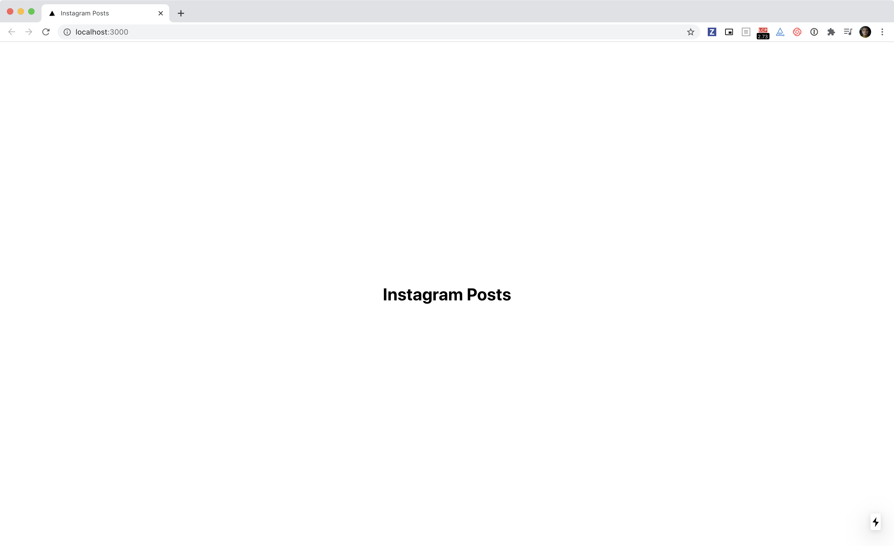
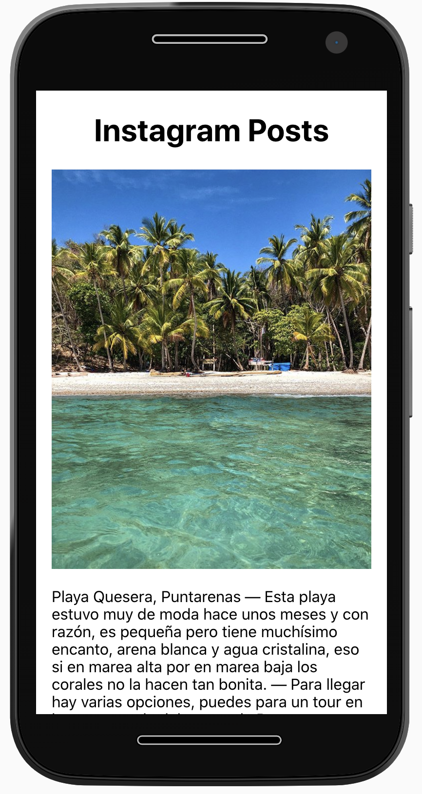

Showing your Instagram Photos in your website (or your client's) allows yout to funnel some traffic from your webapp to your Instagram Account and visa versa. Instagram is a great way to connect with your audience and build up your online brand.

In this post I will show you an example on how to show your last Instagram Posts in your NextJS webapp.

### Start a Next.JS project

Let's start code, first let's initialize a NextJS project. Using `create-next-app`, which sets up everything automatically for you. **Open your Terminal** and run:

```shell
npx create-next-app
# or
yarn create next-app
```

After the installation is complete, run the app in development mode. Just need to `cd` into the folder and run:

```shell
yarn dev
```

This will start your development server in `http://localhost:3000`, open the browser:


### Add Instagram Web API Package

To fetch the Instagram Post we are going to use the an npm package named: `instagram-web-api`. We need to install the package:

```shell
npm install instagram-web-api --save
# or
yarn add instagram-web-api
```

### Updaye your home page

By default, Next.js pre-renders every page. This means that Next.js generates HTML for each page in advance, instead of having it all done by client-side JavaScript.

Open the file `pages/index.js` and replace all the code with:

```javascript
import Head from 'next/head';
import styles from '../styles/Home.module.css';

export default function Home() {
    return (
        <div className={styles.container}>
            <Head>
                <title>Instagram Posts</title>
                <link rel="icon" href="/favicon.ico" />
            </Head>

            <h1>Instagram Posts</h1>
        </div>
    );
}
```

Now your page should look like this:



### Fetching and rendering Instagram Posts

To obtain better performance and SEO we are going to use Static Generated Pages: The HTML is generated at build time and will be reused on each request.

To fetch data at build time we need to export a function `getStaticProps` in our `pages/index.js`

```diff
 import Head from 'next/head';
 import styles from '../styles/Home.module.css';
+import Instagram from 'instagram-web-api';
 
-export default function Home() {
+export default function Home({ posts }) {
     return (
         <div className={styles.container}>
             <Head>
@@ -10,6 +11,31 @@ export default function Home() {
             </Head>
 
             <h1>Instagram Posts</h1>
+            <ul className={styles.list}>
+                {posts.map(({ node }, i) => {
+                    return (
+                        <li key={i}>
+                            
+                            <p>{node.edge_media_to_caption.edges[0]?.node.text}</p>
+                        </li>
+                    );
+                })}
+            </ul>
         </div>
     );
 }
+
+export async function getStaticProps(context) {
+    const client = new Instagram({ username: 'INSTAGRAM_USERNAME', password: 'INSTAGRAM_PASSWORD' });
+    await client.login();
+
+    const response = await client.getPhotosByUsername({
+        username: 'INSTAGRAM_USERNAME',
+    });
+
+    return {
+        props: {
+            posts: response.user.edge_owner_to_timeline_media.edges,
+        }, // will be passed to the page component as props
+    };
+}
```

To fetch the post from Instagram we have need 3 steps:

1. Create the Instagram client
2. Login to Instagram
3. Fetch the data by username.

After we just need to return the posts as props and we receive them in the `Home` React component and we jusr render it.

### Add Styles

Edit your `styles/Home.module.css` and the following code:

```css
.container {
  min-height: 100vh;
  padding: 0 0.5rem;
  display: flex;
  flex-direction: column;
  align-items: center;
  padding: 0 1rem;
}

.list {
    list-style: none;
    margin: 0;
    padding: 0;
}

.list li {
    margin-bottom: 4rem;
    border-bottom: solid 1px lightgray;
    padding-bottom: 2.5rem;
}

.list img {
    max-width: 100%;
}
```

### Result


### More information:

- Repo: [https://github.com/fmontes/nextjs-instagram](https://github.com/fmontes/nextjs-instagram)
- [instagram-web-api](https://github.com/jlobos/instagram-web-api#api-reference)
- [NextJS](https://nextjs.org/)

## Questions?

If you liked this post help me by sharing it and if you have any questions you can write to me on Twitter at [@fmontes](https://twitter.com/fmontes).