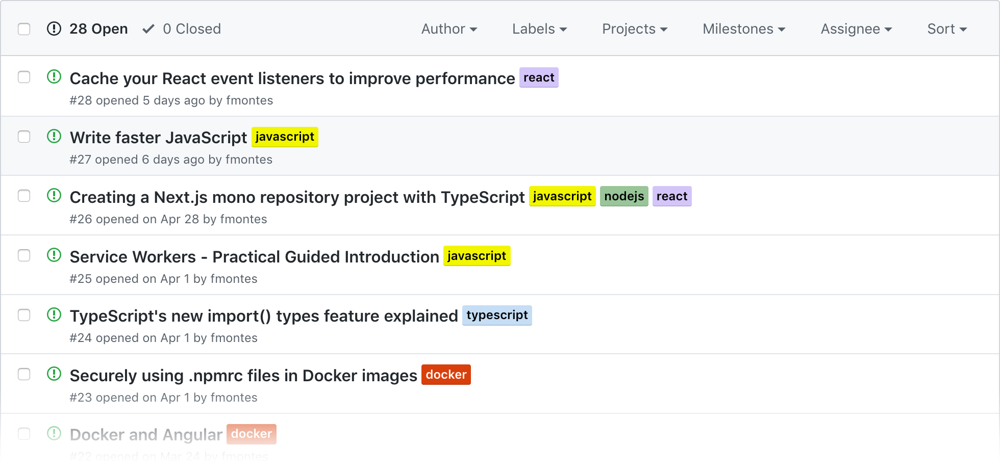

I bet that a lot of times you have to solve something and you think: **"I read some that will help me with this problem"** but you can't remember where you saw it and have no way to find it.

### GitHub to the rescue
What? GitHub? and the answer is big YES. You can create a GitHub Repo and use the issues to track what you read, watch, listen online.

So I started to use GitHub issues, which according to the official information are:

> Use issues to track ideas, enhancements, tasks, or bugs for work on GitHub.

### How to do it?
1. [Create](https://github.com/join) a GitHub account (but I bet you already have one). Mine is: [fmontes](https://github.com/fmontes)
2. [Create a repo](https://help.github.com/en/articles/create-a-repo), mine I called: [learning-tracking](https://github.com/fmontes/learning-tracking).
3. For every piece of content, you want to save [create an issue](https://help.github.com/en/articles/creating-an-issue).
4. And that's pretty much it.

### What to add to the issues?
When I consume some content online I always want to remember certain parts so in my issues I normally add:

1. Code snippets with comments about it
2. Quotes of the article
3. Notes with conclusions
4. Links of course
5. Source

#### GitHub issues support Markdown

This will allow you to add:

1. Code snippets
2. Comments
3. Quotes
4. Links
5. Images
6. Tables
7. And so [much more](https://guides.github.com/features/mastering-markdown/).

### Use tags
You can create and assign to issues as many tags you want, you should use tags in your issues so you can filter them later.

### Search
Not only you'll be able to filter by tags, GitHub has a really powerful search feature, that will find keywords in the title, tags and even content of your issues. You can't lose anything again!

### Conclusion
I tried any notes app you can think of but none of those work for me. With this approach I've seen good results:

1. Haven't lost content anymore
2. Snippets with notes are really helpful
3. Being public (you can make it private) allow your peers to see what your up to
4. Improve your developer brand, people can see what you're up to 😉

