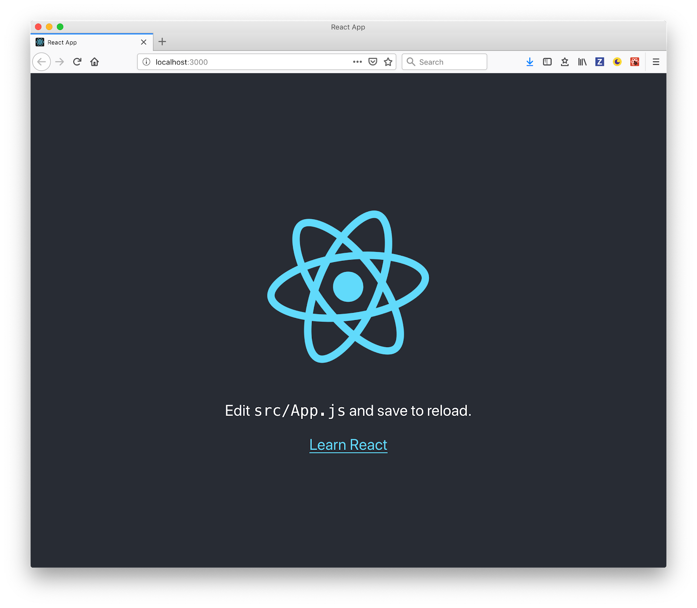
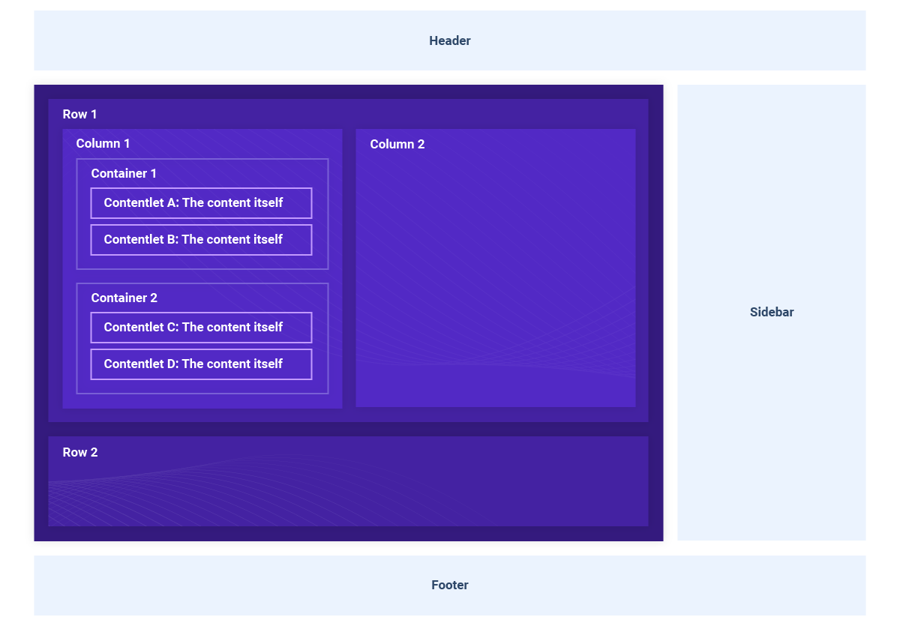

**This is a two part series blog post, [here is the second part](/blog/using-a-headless-cms-and-react-to-build-single-page-apps-part-2).**

## Headless What?

A headless CMS system allows users to control all the content, with strict separation from the display or front-end layers. This allows content creators to focus on what they do best: create high-quality content. A headless CMS architecture empowers marketers and developers to work together to deliver engaging customers experiences. One notable use case for headless CMSs today is creating [Single Page Applications](https://www.google.com/url?q=https://dotcms.com/blog/post/what-is-a-single-page-application-and-should-you-use-one-&sa=D&ust=1551819373872000) (SPA). SPAs deliver more dynamic user experiences, similar to what you might expect from a native mobile application or desktop application, making them very popular with today's customers.

In this piece, I'll walk you through how to use a headless CMS and React to build a SPA, using the headless capabilities of [dotCMS](https://www.google.com/url?q=https://dotcms.com/product/features/headless-cms&sa=D&ust=1551819373872000), an enterprise, open source Java CMS. If you want to jump right into the code, here is the repo: [https://github.com/fmontes/dotcms-page](https://www.google.com/url?q=https://github.com/fmontes/dotcms-page&sa=D&ust=1551819373873000)

## Creating Pages and Layouts From dotCMS's APIs

Almost all headless CMSs on the market have APIs that can be used to distribute various content types to any device or touchpoint; however, what I really like about dotCMS is that you can create pages templates and layouts via its API. This is dotCMS's Layout-as-a-Service, which opens the door for:

- Designers and content editors to update not only the content in a page, but the layout of the page itself, including the sidebar, header, footer, columns, and rows of any individual page.

- SEO and metadata to easily be controlled by the content editor.

- SPA developers have control over which grid system and/or framework they use and can use any CSS approach they prefer, like CSS grids or Flexbox.

Layout-as-a-Service gives dotCMS an edge over other headless CMSs on the market and is something worth looking into; however, for this tutorial, I'll only be retrieving pages that have already been created.

## Before We Get Started, You'll Need

1. Headless CMS (I'll be using [dotCMS](https://www.google.com/url?q=https://dotcms.com/&sa=D&ust=1551819373874000) for this tutorial).
2. Node.js and npm.
3. Some React.js knowledge (I'll walk you through the whole process).

## Let's Build a Single Page Application

Creating a React app is super easy now, thanks to Facebook's CLI tool, called [create-react-app](https://www.google.com/url?q=https://github.com/facebook/create-react-app&sa=D&ust=1551819373875000). It lets you create a React app without having to worry about all the hassle of servers, build, or testing.

First, get your Node.js installed and npm fired up in a terminal, then run:

```bash
npx create-react-app dotcms-page
cd dotcms-page
npm start
```

`npx` will run the `create-react-app` to create a React app called `dotcms-page`. By default, npx will check whether <command> exists in \$PATH or in the local project binaries, and execute. If <command> is not found, it will be installed prior to execution.

With `cd`, we'll browse into the new folder `dotcms-page`.

And by running `npm start` inside the app folder, it will run the app in development mode. Open _http://localhost:3000_ to view it in the browser:



## dotCMS Page Structure

As you can see in the diagram below, the [dotCMS's page](https://www.google.com/url?q=https://dotcms.com/docs/latest/pages&sa=D&ust=1551819373878000) structure is just a nested group of elements: `Rows > Columns > Containers > Content`, where content can be news, events, blog posts, etc.



## The Page Object

The response for the [Page API](https://www.google.com/url?q=https://dotcms.com/docs/latest/page-rest-api-layout-as-a-service-laas&sa=D&ust=1551819373879000) in dotCMS will give all the information on a page, which includes:

- Layout
- Containers
- Page
- Site
- Template

To build a page with React, we'll take into account the layout, containers, and the page contentlets.

### Layout

This object tells us how to render the page, how many rows and columns, what size, offset, etc. Once we have all the information of the rows, columns, containers, and sidebar, we'll use that information to create React components and build our page.

Please note that this object doesn't contain the content of the page, we'll add that in another section of the page object.

Let's take a look at this example of a Layout object:

```typescript
interface Layout {
    pageWidth: any;
    width: any;
    layout: any;
    title: string;
    header: boolean;
    footer: boolean;
    body: {
        rows: [
            {
                identifier: number;
                value: any;
                id: any;
                columns: [
                    {
                        preview: boolean;
                        containers: [
                            {
                                identifier: string;
                                uuid: string;
                            }
                        ];
                        widthPercent: number;
                        width: number;
                        leftOffset: number;
                        left: number;
                    }
                ];
            }
        ];
    };
    sidebar: {
        preview: boolean;
        containers: [
            {
                identifier: string;
                uuid: string;
            }
        ];
        location: string;
        widthPercent: number;
        width: string;
    };
}
```

Now, let's go over the properties we'll be using to create our page using React components:

- `header` and `footer`: used to show or hide the header or footer.
- `body.rows`: this property has all the rows, columns and containers, we will iterate over and render. This object is the representation of the layout of our page.
- `body.rows.columns`: each column contains all the grid information, like the width and the offset of the column as well as the containers inside it. With this information, we'll be able to add any CSS class based on the column width or offset. Since dotCMS is framework agnostic, you can use any CSS Framework, CSS grids or Flexbox.
- `body.rows.columns.containers`: with the container identifier and uuid we can get all the page content.
- `sidebar.location`: values can be left, right or empty, which represents NO sidebar.
- `sidebar.width`: values can be small, medium or large. Based on this value, we can set CSS class and style the size of the sidebar accordingly.
- `sidebar.containers`: is the same as in columns, we'll use identifier and uuid to get the content.

### Containers

Another property we have to consider is the list of [containers](https://www.google.com/url?q=https://dotcms.com/docs/latest/containers&sa=D&ust=1551819373884000) --- here we're going to find all the [contentlets](https://www.google.com/url?q=https://dotcms.com/docs/latest/containers&sa=D&ust=1551819373884000) in the page and we will match them with the identifiers in the Layout to render in the appropriate columns in the page. The containers object use an [entity format](https://www.google.com/url?q=https://opentextbc.ca/dbdesign01/chapter/chapter-8-entity-relationship-model/&sa=D&ust=1551819373885000) which looks like this:

```typescript
interface Containers {
    [identifier: string]: {
        container: {
            identifier: string;
            title: string;
            friendlyName: string;
        };
        contentlets: {
            [uuid: string]: [
                {
                    owner: string;
                    identifier: string;
                    hostName: string;
                    modDate: number;
                    languageId: number;
                    body: string;
                    title: string;
                    url: string;
                    baseType: string;
                    inode: string;
                    titleImage: string;
                    modUserName: string;
                    archived: boolean;
                    folder: string;
                    hasTitleImage: boolean;
                    sortOrder: number;
                    modUser: string;
                    host: string;
                    working: boolean;
                    locked: boolean;
                    stInode: string;
                    contentType: string;
                    live: boolean;
                }
            ];
        };
    };
}
```

In this object, we'll find an entity for each identifier linked to any part of the page, and with the containers identifier in the Layout object, either in the body or in the sidebar, it will find the exact match for the contentlets to render the content in the React component.

`contentles.uuid-[N]:` contains the contentlets information and will vary depending on the content type fields. We'll use those fields to render the contentlets in the page.
