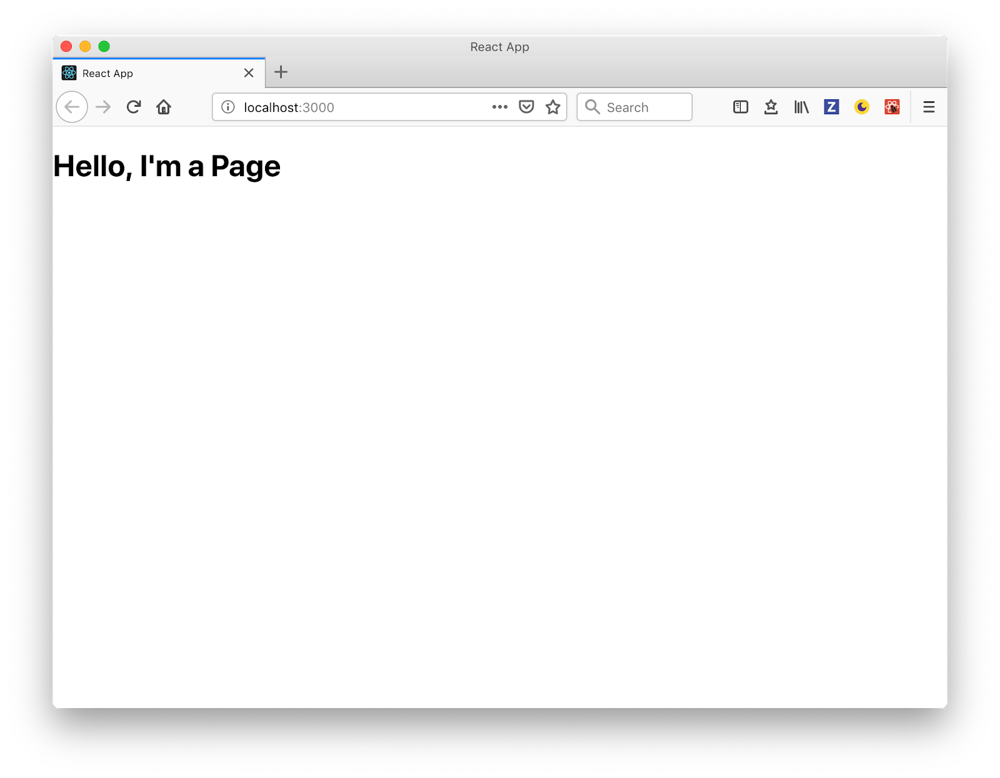
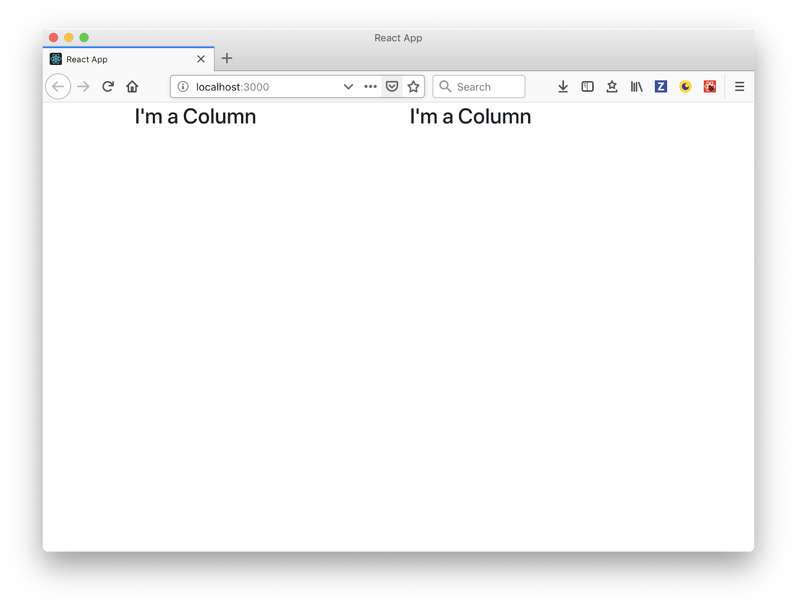
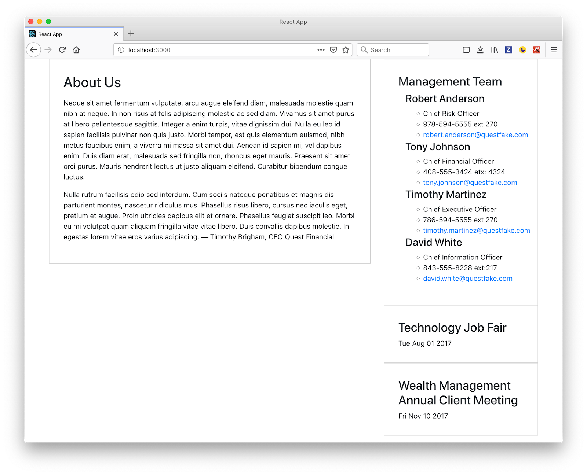

**This is a two part series blog post, [here is the first part](/blog/using-a-headless-cms-and-react-to-build-single-page-apps-part-1).**

## Creating a Page Component

Open the project you generated in the first step in your chosen editor (I'm using [VS Code](https://www.google.com/url?q=https://code.visualstudio.com/&sa=D&ust=1551819373888000)) and inside the folder `src`, create a folder called `components` and, once inside, create a file named `Page.js`. Then add the following code:

```js
import React from 'react'
const Page = () => {
    return <h1>Hello, I'm a Page</h1>
}
export default Page
```

We're not doing much here --- for now, this just a placeholder.

Now open `src/App.js` and replace the content with:

```js
import React, { Component } from 'react'
import './App.css'
import Page from './components/Page'
class App extends Component {
    render() {
        return <Page />
    }
}
export default App
```

Then, clean up the default content that is in the generated React app and replace it with the recently created `<Page />` component (for more information, see the [commit](https://www.google.com/url?q=https://github.com/fmontes/dotcms-page/commit/7ad154916c86a84d950bfcd88f13c8e268d3a13a&sa=D&ust=1551819373892000)). So now in your browser you should see:



We're creating the `<Page />` as a [presentational component](https://www.google.com/url?q=https://medium.com/@yassimortensen/container-vs-presentational-components-in-react-8eea956e1cea&sa=D&ust=1551819373893000), we'll be passing the page object as `props` from the `<App />`, and it will be in charge of receiving and passing down the page object to be rendered in the whole chain of rows, columns, containers, and contentlets.

### Requesting the Page

Using the [componentDidMount](https://www.google.com/url?q=https://reactjs.org/docs/react-component.html%23componentdidmount&sa=D&ust=1551819373894000) component lifecycle method, we'll request the page from the Page API. To do this, open the `<App />` and update it as follows:

```diff
diff --git a/src/App.js b/src/App.js
index 4651bcd..215432a 100755
--- a/src/App.js
+++ b/src/App.js
@@ -3,8 +3,23 @@ import './App.css';
import Page from './components/Page';
class App extends Component {
+    constructor() {
+        super();
+        this.state = {}
+    }
+
+    componentDidMount() {
+        fetch('https://demo.dotcms.com/api/v1/page/json/about-us', {
+            headers: {
+                Authorization: 'Basic ' + btoa('admin@dotcms.com:admin')
+            }
+        })
+            .then(data => data.json())
+            .then(page => this.setState(page.entity));
+    }
+
    render() {
-        return <Page />;
+        return <Page {...this.state} />;
    }
}
```

The [Page API in dotCMS](https://www.google.com/url?q=https://dotcms.com/docs/latest/page-rest-api-layout-as-a-service-laas&sa=D&ust=1551819373897000) works doing a `GET` request to the URL `/api/v1/page/json/` and passing the path to the page we want, in this case `about-us`.

Using the [fetch API](https://www.google.com/url?q=https://developer.mozilla.org/en-US/docs/Web/API/Fetch_API&sa=D&ust=1551819373898000), we do the request to the endpoint and get a response from the page object. This will be assigned to the state of the component that will then be passed down as `props` to the `<Page />` component where the "render chain" of rows, columns, containers, and contentlets will start. Check the [commit](https://www.google.com/url?q=https://github.com/fmontes/dotcms-page/commit/d5ba85dafb62cdb5e4ab3a05a4daedf76df41440&sa=D&ust=1551819373899000) for more information.

**Note** that the dotCMS Page API needs authorization. In this case, we used 'e use', an inline Authorization header property in the fetch, but there are other methods to attain authorization. Check [dotCMS documentation](https://www.google.com/url?q=https://dotcms.com/docs/latest/rest-api-authentication&sa=D&ust=1551819373899000) for more information.

### Rendering Content

The final component structure for each will look like this:

```html
<Row key="1">
    <Column key="1" containers="{column.container}">
        <Container key="1" contentlets="{container.contentlets}">
            <Contentlet key="1" data="contentlet" />
            <Contentlet key="2" data="contentlet" />
            <Contentlet key="N" data="contentlet" />
        </Container>
        <Container key="N" contentlets="{container.contentlets}"></Container>
    </Column>
    <Column key="N" containers="{column.container}"></Column>
    <Row />
    <Row key="N"><Row /></Row
></Row>
```

### Rows

Create a `<Row />` component, and then a create `Row.js` file inside `src/components` folder and add the following code:

```js
import React from 'react'
const Row = () => {
    return <h1>I'm a Row</h1>
}
export default Row
```

Then, add the new `<Row />` component in our `<Page />` component. To do this, open `src/components/Page.js` and implement the following changes:

```diff
diff --git a/src/components/Page.js b/src/components/Page.js
index a5541f3..7eb2cb9 100644
--- a/src/components/Page.js
+++ b/src/components/Page.js
@@ -1,7 +1,13 @@
import React from 'react';
+import Row from './Row';
-const Page = () => {
-        return <h1>Hello, I'm a Page</h1>;
+const Page = props => {
+        const { layout } = props;
+        return layout
+            ? layout.body.rows.map(row => {
+                return <Row key={row.identifier} />;
+            })
+            : null;
};
```

Here we iterate over the `rows` inside the `layout.body` we receive via `props` and for each one we render a `<Row />` component. Full code of this change is in this [commit](https://www.google.com/url?q=https://github.com/fmontes/dotcms-page/commit/63bd89cf30c9a057277c2ae4836d7e1ac68e24bf&sa=D&ust=1551819373908000).

### Preparing Columns With Full Data

Here is where all the chain of render starts; we're going to need all the data from the containers and contentlets. We need to get the full container data from the containers property in the props, which is illustrated in the following diagram:


Let's create a folder called `utils` and an `index.js` file, edit the file and add the following:

```js
function getFullContainers(column, containers) {
    return column.containers.map((container) => {
        const fullContainer = containers[container.identifier]
        return {
            ...fullContainer.container,
            contentlets: fullContainer.contentlets[`uuid-${container.uuid}`],
        }
    })
}

export function getUpdatedColumns(columns, containers) {
    return columns.map((column) => {
        return {
            ...column,
            containers: getFullContainers(column, containers),
        }
    })
}
```

We'll export a function named `getUpdatedColumns` that receives:

1. The columns of a row.
2. The full containers list of the page object.

And return a new array of columns with the full container information extracted from the container list that was matched by the identifier and contentlets in the uuid.

Doing this will allow us to pass the list of columns with all the containers and contentlets inside, which is easier to manage down the component tree.

Now let's update the `<Page />` to use our recently created util function, edit the `src/components/App.js` file and make the following changes:

```diff
diff --git a/src/components/Page.js b/src/components/Page.js
index 26e39ee..c535757 100644
--- a/src/components/Page.js
+++ b/src/components/Page.js
@@ -1,11 +1,13 @@
import React from 'react';
import Row from './Row';
+import { getUpdatedColumns } from '../utils'
const Page = props => {
-        const { layout } = props;
+        const { layout, containers } = props;
        return layout
            ? layout.body.rows.map(row => {
-                return <Row key={row.identifier} />;
+                const columns = getUpdatedColumns(row.columns, containers);
+                return <Row key={row.identifier} columns={columns} />;
            })
            : null;
};
```

If you're having any issues, I recommend checking the [commit](https://www.google.com/url?q=https://github.com/fmontes/dotcms-page/commit/459b90accb9d4951b386809b6646f16056d9b68a&sa=D&ust=1551819373914000) for the full context of the change.

### Columns

For the grid system, as I mentioned earlier, you can use any framework or tool. For this particular example, we used Bootstrap. There is a free-to-use Bootstrap component library for React named [reactstrap](https://www.google.com/url?q=https://reactstrap.github.io/&sa=D&ust=1551819373915000), which we'll use by going to your terminal in the folder project and run:

```bash
npm install --save reactstrap bootstrap
```

Now we need to import the Bootstrap CSS file. Open `src/index.js` and right below the `index.css` import `bootstrap.min.css` add:

```diff
diff --git a/src/index.js b/src/index.js
index 0c5e75d..ea74557 100755
--- a/src/index.js
+++ b/src/index.js
@@ -1,6 +1,7 @@
import React from 'react';
import ReactDOM from 'react-dom';
import './index.css';
+import 'bootstrap/dist/css/bootstrap.min.css';
import App from './App';
import * as serviceWorker from './serviceWorker';
```

Next, add the Bootstrap container for the grid system in the `src/Page.js` component, open the file and update as follows:

```diff
diff --git a/src/components/Page.js b/src/components/Page.js
index c535757..67a496e 100644
--- a/src/components/Page.js
+++ b/src/components/Page.js
@@ -1,15 +1,20 @@
import React from 'react';
import Row from './Row';
import { get Updated Columns } from '../utils';
+import { Container as BtContainer } from 'reactstrap';
const Page = props => {
        const { layout, containers } = props;
-        return layout
-            ? layout.body.rows.map(row => {
-                const columns = getUpdatedColumns(row.columns, containers);
-                return <Row key={row.identifier} columns={columns} />;
-            })
-            : null;
+        return (
+            <BtContainer>
+                {layout
+                    ? layout.body.rows.map(row => {
+                        const columns = getUpdatedColumns(row.columns, containers);
+                        return <Row key={row.identifier} columns={columns} />;
+                    })
+                    : null}
+            </BtContainer>
+        );
};
```

You can now view dotcms-page in the browser.

**Note** that we are using an alias to import the reactstrap `Container as BtContainer` just to make sure we don't get confused with the dotCMS `Container` we'll create next.

Next, we need to add a Bootstrap Row to our Row component, so open `src/components/Row.js` and change:

```diff
diff --git a/src/components/Row.js b/src/components/Row.js
index ee96431..97d8763 100644
--- a/src/components/Row.js
+++ b/src/components/Row.js
@@ -1,7 +1,8 @@
import React from 'react';
+import { Row as BtRow } from 'reactstrap';
const Row = (props) => {
-        return <h1>I'm a Row</h1>;
+        return <BtRow><h1>I'm a Row</h1></BtRow>;
};
```

If you go to the browser and see the page, it should be center now and rendered with the Bootstrap CSS:


We're all set with Bootstrap containers and rows, so let's add the columns and create a new component for each column in `src/components/Column.js`

```js
import React from 'react'
import { Col as BtColumn } from 'reactstrap'

const Column = (props) => {
    return (
        <BtColumn>
            <h3>I'm a Column</h3>
        </BtColumn>
    )
}

export default Column
```

And now we can use our new `<Column />` component inside our `<Row />` component. Open `src/components/Row.js` and replace the placeholder child with columns from the props:

```diff
diff --git a/src/components/Row.js b/src/components/Row.js
index 97d8763..043479b 100644
--- a/src/components/Row.js
+++ b/src/components/Row.js
@@ -1,8 +1,14 @@
import React from 'react';
import { Row as BtRow } from 'reactstrap';
+import Column from './Column';
-const Row = (props) => {
-        return <BtRow><h1>I'm a Row</h1></BtRow>;
+const Row = props => {
+        const { columns } = props;
+        return (
+            <BtRow>
+                {columns.map((column, i) => <Column {...column} key={i} />)}
+            </BtRow>
+        );
};
```

We then map the columns array and render a `<Column />` component for each and pass the column object. If all is good, you should see this in your browser:



At this point, we have the rows and columns rendering correctly but we're not passing the width of the column, let's fix that.

Because each `<Column />` component has a column object, you will see a column `width` property. We'll just need to pass that to the reactstrap column component [according to the documentation](https://www.google.com/url?q=http://reactstrap.github.io/components/layout/&sa=D&ust=1551819373929000):

```diff
diff --git a/src/components/Column.js b/src/components/Column.js
index e3ac3e3..a780c43 100644
--- a/src/components/Column.js
+++ b/src/components/Column.js
@@ -2,7 +2,7 @@ import React from 'react';
import { Col as BtColumn } from 'reactstrap';
const Column = (props) => {
-        return <BtColumn><h3>I'm a Column</h3></BtColumn>;
+        return <Column sm={props.width}><h3>I'm a Column</h3></BtColumn>;
};
```

You should be able to see the left column bigger in your browser:


If you run into any issues, take a look at the [commit](https://www.google.com/url?q=https://github.com/fmontes/dotcms-page/commit/8b25c8225085d6f07da9244e5a336db2ad07d506&sa=D&ust=1551819373931000) for this change.

### Containers and Contentlets

Inside each column, we have an array of containers and inside each container is an array of Contentlets. It is these contentlets that we are going to render.

First, let's create a Contentlet component in `src/components/Contentlet.js` and add the following code:

```js
import React from 'react'

const Contentlet = (props) => {
    return <h3>I'm a Contentlet</h3>
}
export default Contentlet
```

Second, create a container component in `src/components/Container.js` and add the following code:

```js
import React from 'react'
import Contentlet from './Contentlet'

const Container = (props) => {
    return props.contentlets.map((contentlet, i) => <Contentlet key={i} {...contentlet} />)
}
export default Container
```

As you can see, in the `<Container />` component we map over the contentlets inside the container and render a `<Contentlet />` for each one.

And now we have to use our new ```<Container /> \*\*component. Open the `src/components/Column.js` and add the following:

```diff
diff --git a/src/components/Column.js b/src/components/Column.js
index a780c43..964475d 100644
--- a/src/components/Column.js
+++ b/src/components/Column.js
@@ -1,8 +1,15 @@
import React from 'react';
import { Col as BtColumn } from 'reactstrap';
+import Container from './Container';
-const Column = (props) => {
-    return <BtColumn sm={props.width}><h3>I'm a Column</h3></BtColumn>;
+const Column = props => {
+    return (
+        <BtColumn sm={props.width}>
+            {props.containers.map(container => (
+                <Container {...container} />
+            ))}
+        </BtColumn>
+    );
};
```

Now that we have all the structure of the page rendered - the chain of `Page > Row > Column > Container > Contentlet` - you should see this in your browser:


Finally, to see all the render page chain done, view the [commit](https://www.google.com/url?q=https://github.com/fmontes/dotcms-page/commit/9b817e8bde15ef180d7a455aef7eb80aa28205c3&sa=D&ust=1551819373938000).

### Contentlet Information

Each contentlet has its own fields based on the content type that they belong to. Let's use those fields to render the contentlets accordingly.

You can check the [documentation for content types in dotCMS](https://www.google.com/url?q=https://dotcms.com/docs/latest/content-types&sa=D&ust=1551819373939000) for more information.

In this page we have three content types:

1. Generic content
2. Widget
3. Event

Let's create a React component for each type. First, create a file `src/components/ContentGeneric.js` and add the following:

```js
import React from 'react'

const ContentGeneric = (props) => {
    return <div dangerouslySetInnerHTML={{ __html: props.body }} />
}
export default ContentGeneric
```

This component is simple, just show the `body` field from the generic content type that is in HTML code in a `<div>`.

We also need a Calendar Event component. Create a file in `src/components/Event.js` and add the following code:

```js
import React from 'react'

const Event = (props) => {
    return (
        <>
            <h3>{props.title}</h3>
            <time>{new Date(props.startDate).toDateString()}</time>
        </>
    )
}

export default Event
```

In the case of Calendar Events, we only show the title and the start date.

The Simple Widget contentlet needs a little bit more work. Create the file src/components/Event.js and add the following:

```js
import React, { Component } from 'react'

export default class SimpleWidget extends Component {
    constructor() {
        super()

        this.state = {
            html: '',
        }
    }

    componentDidMount() {
        fetch(`https://demo.dotcms.com/api/widget/id/${this.props.identifier}`)
            .then((response) => response.text())

            .then((html) => {
                this.setState({
                    html: html,
                })
            })
    }

    render() {
        return <div dangerouslySetInnerHTML={{ __html: this.state.html }} />
    }
}
```

Because the Simple Widget is dynamic and the content can change, dotCMS doesn't send the HTML in the response, but there is a [Widget API](https://www.google.com/url?q=https://dotcms.com/docs/latest/widget-api&sa=D&ust=1551819373947000) where you can get the HTML and render it into the component, which is exactly what we did here:

1. Create a state in the component.
2. Fetch the widget HTML in the componentDidMount.
3. Set the state and render the HTML.

To finish, we need to show any of the contentlet components we just created depending on the content type. To do this, edit the `src/components/Contentlet.js`

```diff
diff --git a/src/components/Contentlet.js b/src/components/Contentlet.js
index d03a3f3..e7aae73 100644
--- a/src/components/Contentlet.js
+++ b/src/components/Contentlet.js
@@ -1,7 +1,24 @@
import React from 'react';
+import ContentGeneric from './ContentGeneric';
+import Event from './Event';
+import SimpleWidget from './SimpleWidget';
-const Contentlet = (props) => {
-    return <h3>I'm a Contentlet</h3>;
+function getComponent(type) {
+    switch (type) {
+        case 'webPageContent':
+            return ContentGeneric;
+        case 'SimpleWidget':
+            return SimpleWidget;
+        case 'calendarEvent':
+            return Event;
+        default:
+            return ContentGeneric;
+    }
+}
+
+const Contentlet = props => {
+    const Component = getComponent(props.contentType);
+    return <Component {...props} />;
```

What we did here was we created a function that receives the `type` of contentlet and returns a specific React Component based on that string, which could be `ContentGeneric`, `SimpleWidget` or `Event`, at least for this page. Then we render that component and pass the contentlet so we can render any of content we need.

And that's it! In the end, you should see something like this:



Here is the final [commit](https://www.google.com/url?q=https://github.com/fmontes/dotcms-page/commit/e0513fbd561c40b867791c549c76813f065d4193&sa=D&ust=1551819373952000) for the contentlet specific render, with the [full code available via Github](https://www.google.com/url?q=https://github.com/fmontes/dotcms-page&sa=D&ust=1551819373952000).

## Headless CMS + React = A Win-Win for Single Page App Developement

The [headless capabilities](https://dotcms.com/product/features/headless-cms) of dotCMS not only allows you to render content in a Single Page App but also non-dev users can control the layout of each page and the developer can jump in and create really specific web apps without too much hassle.
