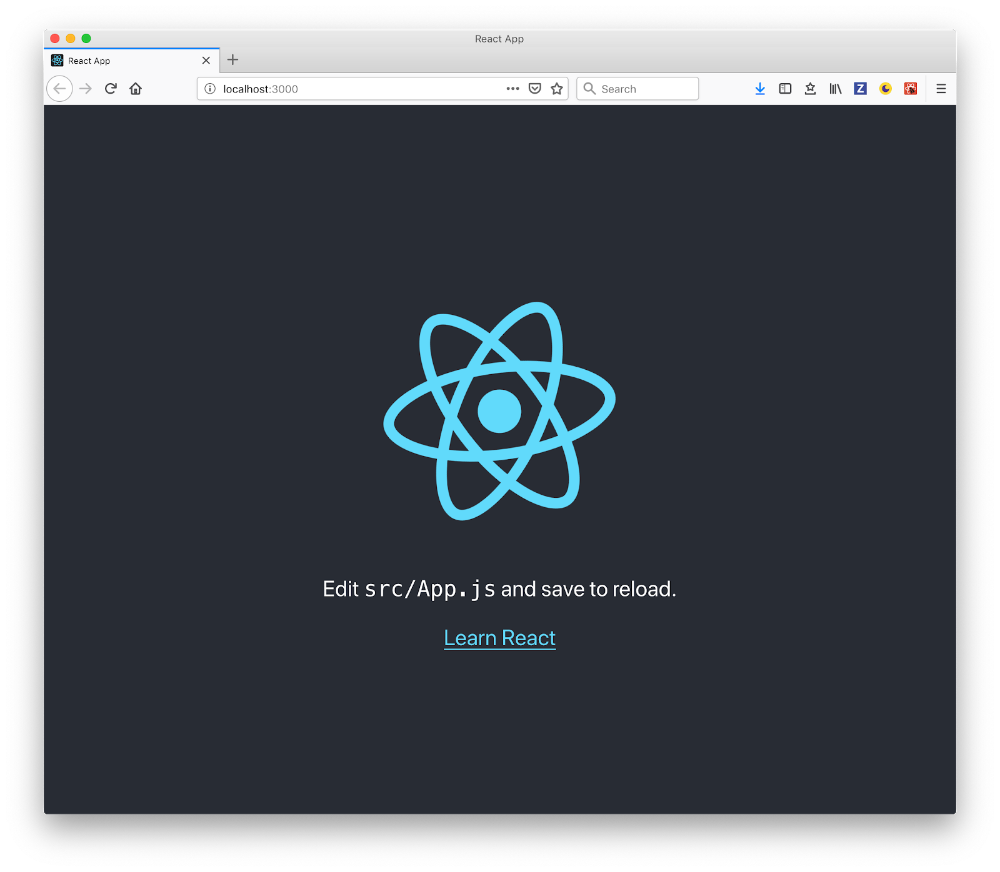
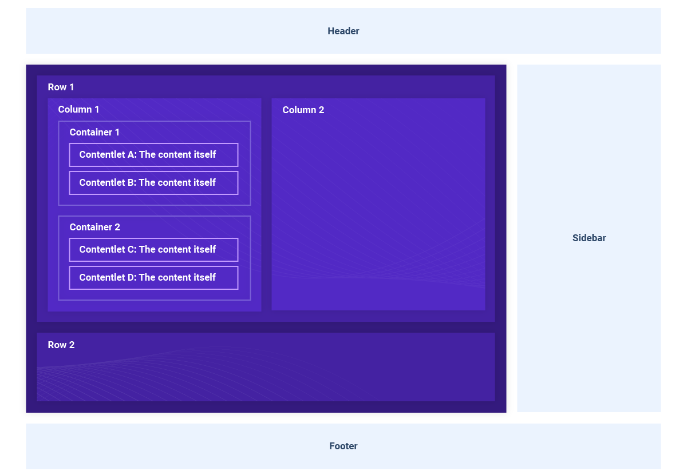
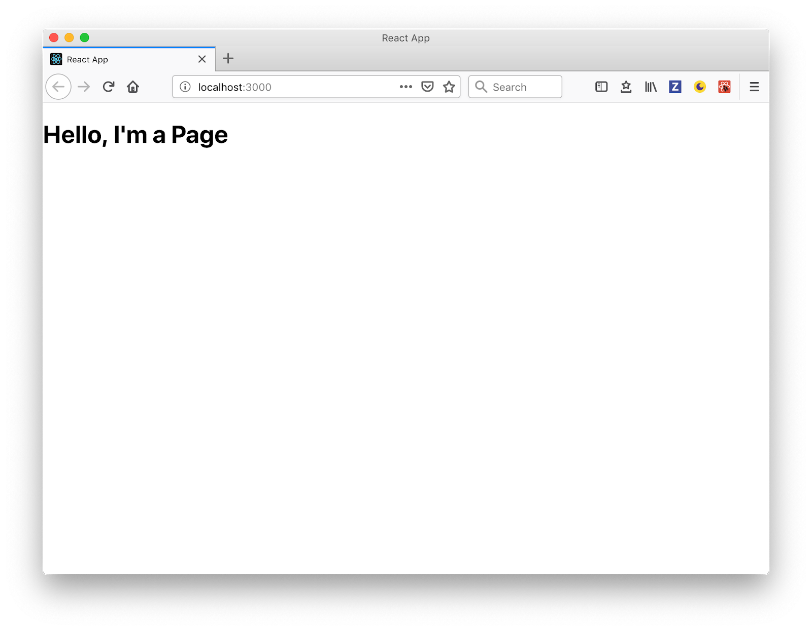
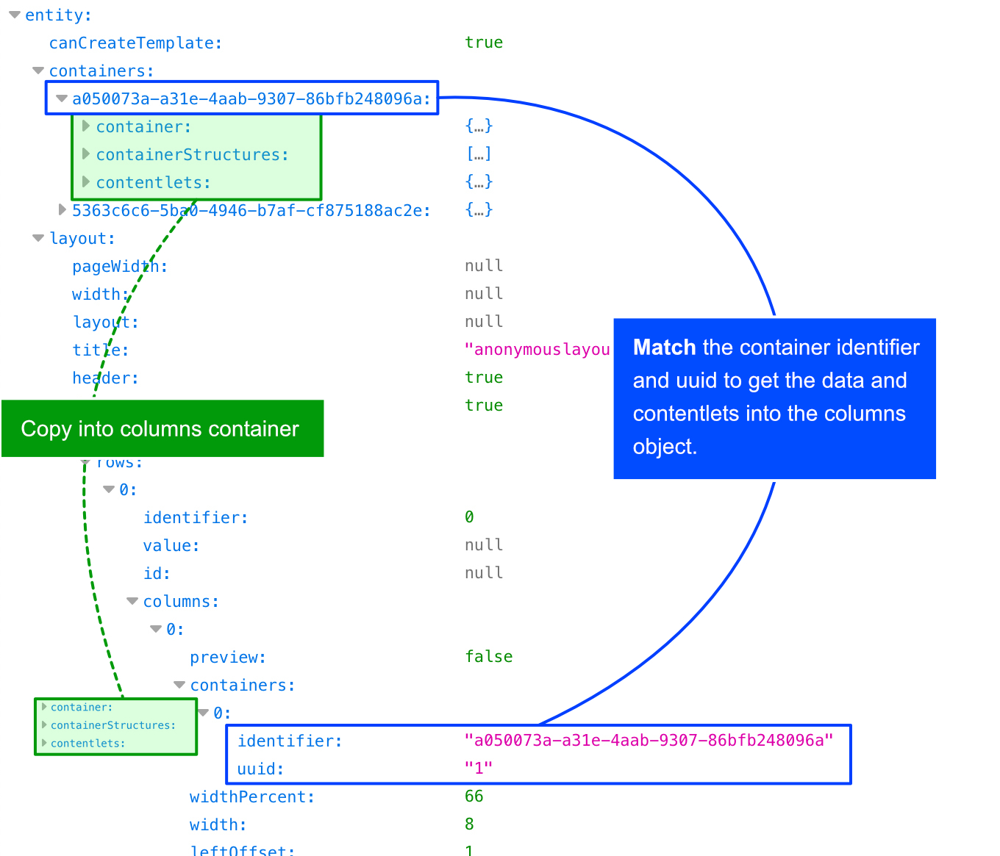
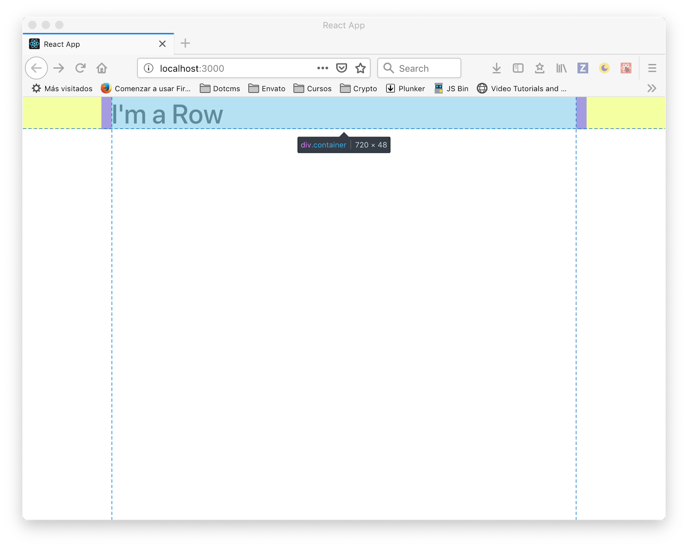
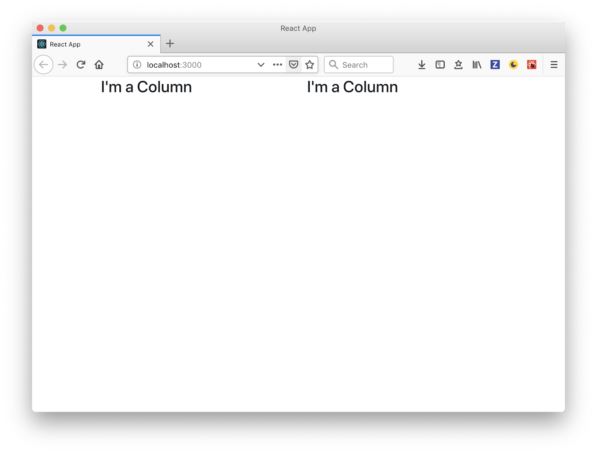
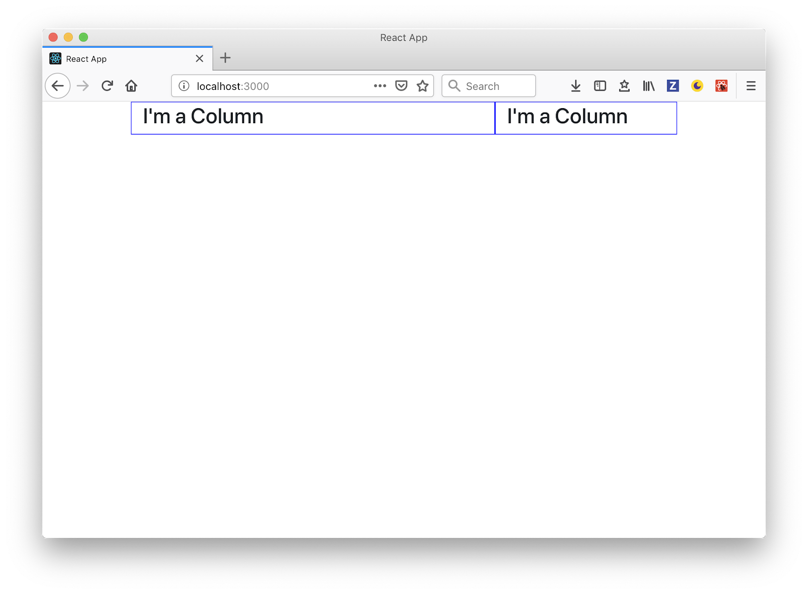
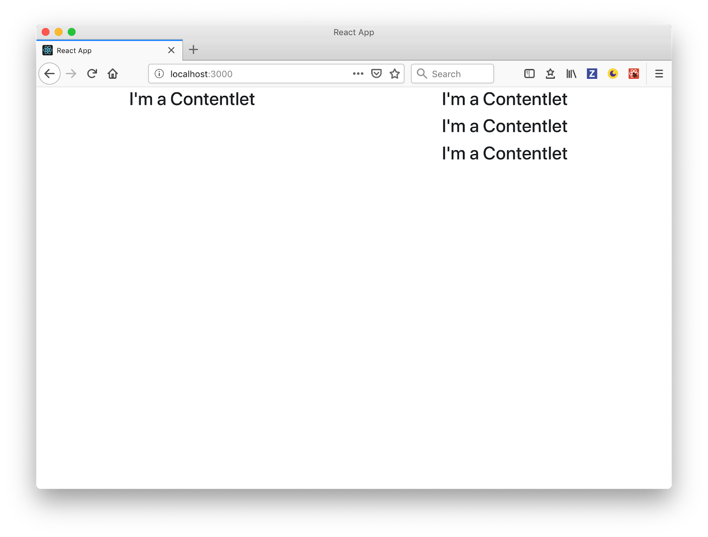
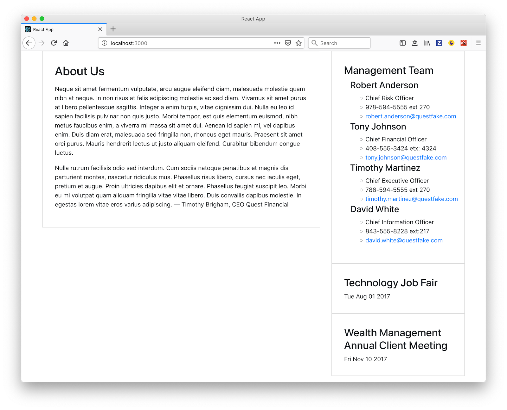

A headless CMS system allows users to control all the content, with strict separation from the display or front-end layers. This allows content creators to focus on what they do best: create high-quality content. A headless CMS architecture empowers marketers and developers to work together to deliver engaging customers experiences. One notable use case for headless CMSs today is creating [Single Page Applications](https://www.google.com/url?q=https://dotcms.com/blog/post/what-is-a-single-page-application-and-should-you-use-one-&sa=D&ust=1551819373872000) (SPA). SPAs deliver more dynamic user experiences, similar to what you might expect from a native mobile application or desktop application, making them very popular with today's customers.

In this piece, I'll walk you through how to use a headless CMS and React to build a SPA, using the headless capabilities of [dotCMS](https://www.google.com/url?q=https://dotcms.com/product/features/headless-cms&sa=D&ust=1551819373872000), an enterprise, open source Java CMS. If you want to jump right into the code, here is the repo: [https://github.com/fmontes/dotcms-page](https://www.google.com/url?q=https://github.com/fmontes/dotcms-page&sa=D&ust=1551819373873000)

## Creating Pages and Layouts From dotCMS's APIs

Almost all headless CMSs on the market have APIs that can be used to distribute various content types to any device or touchpoint; however, what I really like about dotCMS is that you can create pages templates and layouts via its API. This is dotCMS's Layout-as-a-Service, which opens the door for:

- Designers and content editors to update not only the content in a page, but the layout of the page itself, including the sidebar, header, footer, columns, and rows of any individual page.

- SEO and metadata to easily be controlled by the content editor.

- SPA developers have control over which grid system and/or framework they use and can use any CSS approach they prefer, like CSS grids or Flexbox.

Layout-as-a-Service gives dotCMS an edge over other headless CMSs on the market and is something worth looking into; however, for this tutorial, I'll only be retrieving pages that have already been created.

## Before We Get Started, You'll Need

1. Headless CMS (I'll be using [dotCMS](https://www.google.com/url?q=https://dotcms.com/&sa=D&ust=1551819373874000) for this tutorial).
2. Node.js and npm.
3. Some React.js knowledge (I'll walk you through the whole process).

## Let's Build a Single Page Application

Creating a React app is super easy now, thanks to Facebook's CLI tool, called [create-react-app](https://www.google.com/url?q=https://github.com/facebook/create-react-app&sa=D&ust=1551819373875000). It lets you create a React app without having to worry about all the hassle of servers, build, or testing.

First, get your Node.js installed and npm fired up in a terminal, then run:

```bash
npx create-react-app dotcms-page
cd dotcms-page
npm start
```

`npx` will run the `create-react-app` to create a React app called `dotcms-page`. By default, npx will check whether <command> exists in \$PATH or in the local project binaries, and execute. If <command> is not found, it will be installed prior to execution.

With `cd`, we'll browse into the new folder `dotcms-page`.

And by running `npm start` inside the app folder, it will run the app in development mode. Open _http://localhost:3000_ to view it in the browser:



## dotCMS Page Structure

As you can see in the diagram below, the [dotCMS's page](https://www.google.com/url?q=https://dotcms.com/docs/latest/pages&sa=D&ust=1551819373878000) structure is just a nested group of elements: `Rows > Columns > Containers > Content`, where content can be news, events, blog posts, etc.



## The Page Object

The response for the [Page API](https://www.google.com/url?q=https://dotcms.com/docs/latest/page-rest-api-layout-as-a-service-laas&sa=D&ust=1551819373879000) in dotCMS will give all the information on a page, which includes:

- Layout
- Containers
- Page
- Site
- Template

To build a page with React, we'll take into account the layout, containers, and the page contentlets.

### Layout

This object tells us how to render the page, how many rows and columns, what size, offset, etc. Once we have all the information of the rows, columns, containers, and sidebar, we'll use that information to create React components and build our page.

Please note that this object doesn't contain the content of the page, we'll add that in another section of the page object.

Let's take a look at this example of a Layout object:

```typescript
interface Layout {
    pageWidth: any;
    width: any;
    layout: any;
    title: string;
    header: boolean;
    footer: boolean;
    body: {
        rows: [
            {
                identifier: number;
                value: any;
                id: any;
                columns: [
                    {
                        preview: boolean;
                        containers: [
                            {
                                identifier: string;
                                uuid: string;
                            }
                        ];
                        widthPercent: number;
                        width: number;
                        leftOffset: number;
                        left: number;
                    }
                ];
            }
        ];
    };
    sidebar: {
        preview: boolean;
        containers: [
            {
                identifier: string;
                uuid: string;
            }
        ];
        location: string;
        widthPercent: number;
        width: string;
    };
}
```

Now, let's go over the properties we'll be using to create our page using React components:

- `header` and `footer`: used to show or hide the header or footer.
- `Body.rows`: this property has all the rows, columns and containers, we will iterate over and render. This object is the representation of the layout of our page.
- `body.rows.columns`: each column contains all the grid information, like the width and the offset of the column as well as the containers inside it. With this information, we'll be able to add any CSS class based on the column width or offset. Since dotCMS is framework agnostic, you can use any CSS Framework, CSS grids or Flexbox.
- `body.rows.columns.containers`: with the container identifier and uuid we can get all the page content.
- `sidebar.location`: values can be left, right or empty, which represents NO sidebar.
- `sidebar.width`: values can be small, medium or large. Based on this value, we can set CSS class and style the size of the sidebar accordingly.
- `sidebar.containers`: is the same as in columns, we'll use identifier and uuid to get the content.

### Containers

Another property we have to consider is the list of [containers](https://www.google.com/url?q=https://dotcms.com/docs/latest/containers&sa=D&ust=1551819373884000) --- here we're going to find all the [contentlets](https://www.google.com/url?q=https://dotcms.com/docs/latest/containers&sa=D&ust=1551819373884000) in the page and we will match them with the identifiers in the Layout to render in the appropriate columns in the page. The containers object use an [entity format](https://www.google.com/url?q=https://opentextbc.ca/dbdesign01/chapter/chapter-8-entity-relationship-model/&sa=D&ust=1551819373885000) which looks like this:

```typescript
interface Containers {
    [identifier: string]: {
        container: {
            identifier: string;
            title: string;
            friendlyName: string;
        };
        contentlets: {
            [uuid: string]: [
                {
                    owner: string;
                    identifier: string;
                    hostName: string;
                    modDate: number;
                    languageId: number;
                    body: string;
                    title: string;
                    url: string;
                    baseType: string;
                    inode: string;
                    titleImage: string;
                    modUserName: string;
                    archived: boolean;
                    folder: string;
                    hasTitleImage: boolean;
                    sortOrder: number;
                    modUser: string;
                    host: string;
                    working: boolean;
                    locked: boolean;
                    stInode: string;
                    contentType: string;
                    live: boolean;
                }
            ];
        };
    };
}
```

In this object, we'll find an entity for each identifier linked to any part of the page, and with the containers identifier in the Layout object, either in the body or in the sidebar, it will find the exact match for the contentlets to render the content in the React component.

`contentles.uuid-[N]:` contains the contentlets information and will vary depending on the content type fields. We'll use those fields to render the contentlets in the page.

### Creating a Page Component

Open the project you generated in the first step in your chosen editor (I'm using [VS Code](https://www.google.com/url?q=https://code.visualstudio.com/&sa=D&ust=1551819373888000)) and inside the folder `src`, create a folder called `components` and, once inside, create a file named `Page.js`. Then add the following code:

```js
import React from 'react';
const Page = () => {
    return <h1>Hello, I'm a Page</h1>;
};
export default Page;
```

We're not doing much here --- for now, this just a placeholder.

Now open `src/App.js` and replace the content with:

```js
import React, { Component } from 'react';
import './App.css';
import Page from './components/Page';
class App extends Component {
    render() {
        return <Page />;
    }
}
export default App;
```

Then, clean up the default content that is in the generated React app and replace it with the recently created ```<Page />``` component (for more information, see the [commit](https://www.google.com/url?q=https://github.com/fmontes/dotcms-page/commit/7ad154916c86a84d950bfcd88f13c8e268d3a13a&sa=D&ust=1551819373892000)). So now in your browser you should see:



We're creating the ```<Page />``` as a [presentational component](https://www.google.com/url?q=https://medium.com/@yassimortensen/container-vs-presentational-components-in-react-8eea956e1cea&sa=D&ust=1551819373893000), we'll be passing the page object as `props` from the ```<App />```, and it will be in charge of receiving and passing down the page object to be rendered in the whole chain of rows, columns, containers, and contentlets.

### Requesting the Page

Using the [componentDidMount](https://www.google.com/url?q=https://reactjs.org/docs/react-component.html%23componentdidmount&sa=D&ust=1551819373894000) component lifecycle method, we'll request the page from the Page API. To do this, open the ```<App />``` and update it as follows:

```diff
diff --git a/src/App.js b/src/App.js
index 4651bcd..215432a 100755
--- a/src/App.js
+++ b/src/App.js
@@ -3,8 +3,23 @@ import './App.css';
import Page from './components/Page';
class App extends Component {
+    constructor() {
+        super();
+        this.state = {}
+    }
+
+    componentDidMount() {
+        fetch('https://demo.dotcms.com/api/v1/page/json/about-us', {
+            headers: {
+                Authorization: 'Basic ' + btoa('admin@dotcms.com:admin')
+            }
+        })
+            .then(data => data.json())
+            .then(page => this.setState(page.entity));
+    }
+
    render() {
-        return <Page />;
+        return <Page {...this.state} />;
    }
}
```

The [Page API in dotCMS](https://www.google.com/url?q=https://dotcms.com/docs/latest/page-rest-api-layout-as-a-service-laas&sa=D&ust=1551819373897000) works doing a `GET` request to the URL `/api/v1/page/json/` and passing the path to the page we want, in this case `about-us`.

Using the [fetch API](https://www.google.com/url?q=https://developer.mozilla.org/en-US/docs/Web/API/Fetch_API&sa=D&ust=1551819373898000), we do the request to the endpoint and get a response from the page object. This will be assigned to the state of the component that will then be passed down as `props` to the ```<Page />``` component where the "render chain" of rows, columns, containers, and contentlets will start. Check the [commit](https://www.google.com/url?q=https://github.com/fmontes/dotcms-page/commit/d5ba85dafb62cdb5e4ab3a05a4daedf76df41440&sa=D&ust=1551819373899000) for more information.

**Note** that the dotCMS Page API needs authorization. In this case, we used 'e use', an inline Authorization header property in the fetch, but there are other methods to attain authorization. Check [dotCMS documentation](https://www.google.com/url?q=https://dotcms.com/docs/latest/rest-api-authentication&sa=D&ust=1551819373899000) for more information.

### Rendering Content

The final component structure for each will look like this:

```html
<Row key="1">
    <Column key="1" containers={column.container}>
    <Container key="1" contentlets={container.contentlets}>
    <Contentlet key="1" data="contentlet" />
    <Contentlet key="2" data="contentlet" />
    <Contentlet key="N" data="contentlet" />
    </Container>
    <Container key="N" contentlets={container.contentlets}></Container>
    </Column>
    <Column key="N" containers={column.container}></Column>
<Row/>
<Row key="N"><Row/>
```

### Rows

Create a ```<Row />``` component, and then a create `Row.js` file inside `src/components` folder and add the following code:

```js
import React from 'react';
const Row = () => {
    return <h1>I'm a Row</h1>;
};
export default Row;
```

Then, add the new ```<Row />``` component in our ```<Page />``` component. To do this, open `src/components/Page.js` and implement the following changes:

```diff
diff --git a/src/components/Page.js b/src/components/Page.js
index a5541f3..7eb2cb9 100644
--- a/src/components/Page.js
+++ b/src/components/Page.js
@@ -1,7 +1,13 @@
import React from 'react';
+import Row from './Row';
-const Page = () => {
-        return <h1>Hello, I'm a Page</h1>;
+const Page = props => {
+        const { layout } = props;
+        return layout
+            ? layout.body.rows.map(row => {
+                return <Row key={row.identifier} />;
+            })
+            : null;
};
```

Here we iterate over the `rows` inside the `layout.body` we receive via `props` and for each one we render a ```<Row />``` component. Full code of this change is in this [commit](https://www.google.com/url?q=https://github.com/fmontes/dotcms-page/commit/63bd89cf30c9a057277c2ae4836d7e1ac68e24bf&sa=D&ust=1551819373908000).

### Preparing Columns With Full Data

Here is where all the chain of render starts; we're going to need all the data from the containers and contentlets. We need to get the full container data from the containers property in the props, which is illustrated in the following diagram:



Let's create a folder called `utils` and an `index.js` file, edit the file and add the following:

```js
function getFullContainers(column, containers) {
    return column.containers.map(container => {
        const fullContainer = containers[container.identifier];
        return {
            ...fullContainer.container,
            contentlets: fullContainer.contentlets[`uuid-${container.uuid}`]
        };
    });
};

export function getUpdatedColumns(columns, containers) {
    return columns.map(column => {
        return {
            ...column,
            containers: getFullContainers(column, containers)
        };
    });
};
```

We'll export a function named `getUpdatedColumns` that receives:

1. The columns of a row.
2. The full containers list of the page object.

And return a new array of columns with the full container information extracted from the container list that was matched by the identifier and contentlets in the uuid.

Doing this will allow us to pass the list of columns with all the containers and contentlets inside, which is easier to manage down the component tree.

Now let's update the ```<Page />``` to use our recently created util function, edit the `src/components/App.js` file and make the following changes:

```diff
diff --git a/src/components/Page.js b/src/components/Page.js
index 26e39ee..c535757 100644
--- a/src/components/Page.js
+++ b/src/components/Page.js
@@ -1,11 +1,13 @@
import React from 'react';
import Row from './Row';
+import { getUpdatedColumns } from '../utils'
const Page = props => {
-        const { layout } = props;
+        const { layout, containers } = props;
        return layout
            ? layout.body.rows.map(row => {
-                return <Row key={row.identifier} />;
+                const columns = getUpdatedColumns(row.columns, containers);
+                return <Row key={row.identifier} columns={columns} />;
            })
            : null;
};
```

If you're having any issues, I recommend checking the [commit](https://www.google.com/url?q=https://github.com/fmontes/dotcms-page/commit/459b90accb9d4951b386809b6646f16056d9b68a&sa=D&ust=1551819373914000) for the full context of the change.

### Columns

For the grid system, as I mentioned earlier, you can use any framework or tool. For this particular example, we used Bootstrap. There is a free-to-use Bootstrap component library for React named [reactstrap](https://www.google.com/url?q=https://reactstrap.github.io/&sa=D&ust=1551819373915000), which we'll use by going to your terminal in the folder project and run:

```bash
npm install --save reactstrap bootstrap
```

Now we need to import the Bootstrap CSS file. Open `src/index.js` and right below the `index.css` import `bootstrap.min.css` add:

```diff
diff --git a/src/index.js b/src/index.js
index 0c5e75d..ea74557 100755
--- a/src/index.js
+++ b/src/index.js
@@ -1,6 +1,7 @@
import React from 'react';
import ReactDOM from 'react-dom';
import './index.css';
+import 'bootstrap/dist/css/bootstrap.min.css';
import App from './App';
import * as serviceWorker from './serviceWorker';
```

Next, add the Bootstrap container for the grid system in the `src/Page.js` component, open the file and update as follows:

```diff
diff --git a/src/components/Page.js b/src/components/Page.js
index c535757..67a496e 100644
--- a/src/components/Page.js
+++ b/src/components/Page.js
@@ -1,15 +1,20 @@
import React from 'react';
import Row from './Row';
import { get Updated Columns } from '../utils';
+import { Container as BtContainer } from 'reactstrap';
const Page = props => {
        const { layout, containers } = props;
-        return layout
-            ? layout.body.rows.map(row => {
-                const columns = getUpdatedColumns(row.columns, containers);
-                return <Row key={row.identifier} columns={columns} />;
-            })
-            : null;
+        return (
+            <BtContainer>
+                {layout
+                    ? layout.body.rows.map(row => {
+                        const columns = getUpdatedColumns(row.columns, containers);
+                        return <Row key={row.identifier} columns={columns} />;
+                    })
+                    : null}
+            </BtContainer>
+        );
};
```

You can now view dotcms-page in the browser.

**Note** that we are using an alias to import the reactstrap `Container as BtContainer` just to make sure we don't get confused with the dotCMS `Container` we'll create next.

Next, we need to add a Bootstrap Row to our Row component, so open `src/components/Row.js` and change:

```diff
diff --git a/src/components/Row.js b/src/components/Row.js
index ee96431..97d8763 100644
--- a/src/components/Row.js
+++ b/src/components/Row.js
@@ -1,7 +1,8 @@
import React from 'react';
+import { Row as BtRow } from 'reactstrap';
const Row = (props) => {
-        return <h1>I'm a Row</h1>;
+        return <BtRow><h1>I'm a Row</h1></BtRow>;
};
```

If you go to the browser and see the page, it should be center now and rendered with the Bootstrap CSS:



We're all set with Bootstrap containers and rows, so let's add the columns and create a new component for each column in `src/components/Column.js`

```js
import React from 'react';
import { Col as BtColumn } from 'reactstrap';

const Column = (props) => {
    return <BtColumn><h3>I'm a Column</h3></BtColumn>;
};

export default Column;
```

And now we can use our new ```<Column />``` component inside our ```<Row />``` component. Open `src/components/Row.js` and replace the placeholder child with columns from the props:

```diff
diff --git a/src/components/Row.js b/src/components/Row.js
index 97d8763..043479b 100644
--- a/src/components/Row.js
+++ b/src/components/Row.js
@@ -1,8 +1,14 @@
import React from 'react';
import { Row as BtRow } from 'reactstrap';
+import Column from './Column';
-const Row = (props) => {
-        return <BtRow><h1>I'm a Row</h1></BtRow>;
+const Row = props => {
+        const { columns } = props;
+        return (
+            <BtRow>
+                {columns.map((column, i) => <Column {...column} key={i} />)}
+            </BtRow>
+        );
};
```

We then map the columns array and render a ```<Column />``` component for each and pass the column object. If all is good, you should see this in your browser:



At this point, we have the rows and columns rendering correctly but we're not passing the width of the column, let's fix that.

Because each ```<Column />``` component has a column object, you will see a column `width` property. We'll just need to pass that to the reactstrap column component [according to the documentation](https://www.google.com/url?q=http://reactstrap.github.io/components/layout/&sa=D&ust=1551819373929000):

```diff
diff --git a/src/components/Column.js b/src/components/Column.js
index e3ac3e3..a780c43 100644
--- a/src/components/Column.js
+++ b/src/components/Column.js
@@ -2,7 +2,7 @@ import React from 'react';
import { Col as BtColumn } from 'reactstrap';
const Column = (props) => {
-        return <BtColumn><h3>I'm a Column</h3></BtColumn>;
+        return <Column sm={props.width}><h3>I'm a Column</h3></BtColumn>;
};
```

You should be able to see the left column bigger in your browser:



If you run into any issues, take a look at the [commit](https://www.google.com/url?q=https://github.com/fmontes/dotcms-page/commit/8b25c8225085d6f07da9244e5a336db2ad07d506&sa=D&ust=1551819373931000) for this change.

### Containers and Contentlets

Inside each column, we have an array of containers and inside each container is an array of Contentlets. It is these contentlets that we are going to render.

First, let's create a Contentlet component in `src/components/Contentlet.js` and add the following code:

```js
import React from 'react';

const Contentlet = (props) => {
    return <h3>I'm a Contentlet</h3>;
};
export default Contentlet;
```

Second, create a container component in `src/components/Container.js` and add the following code:

```js
import React from 'react';
import Contentlet from './Contentlet';

const Container = (props) => {
    return props.contentlets.map((contentlet, i) => <Contentlet key={i} {...contentlet} />);
};
export default Container;
```

As you can see, in the ```<Container />``` component we map over the contentlets inside the container and render a ```<Contentlet />``` for each one.

And now we have to use our new ```<Container /> **component. Open the `src/components/Column.js` and add the following:

```diff
diff --git a/src/components/Column.js b/src/components/Column.js
index a780c43..964475d 100644
--- a/src/components/Column.js
+++ b/src/components/Column.js
@@ -1,8 +1,15 @@
import React from 'react';
import { Col as BtColumn } from 'reactstrap';
+import Container from './Container';
-const Column = (props) => {
-    return <BtColumn sm={props.width}><h3>I'm a Column</h3></BtColumn>;
+const Column = props => {
+    return (
+        <BtColumn sm={props.width}>
+            {props.containers.map(container => (
+                <Container {...container} />
+            ))}
+        </BtColumn>
+    );
};
```

Now that we have all the structure of the page rendered - the chain of `Page > Row > Column > Container > Contentlet` - you should see this in your browser:



Finally, to see all the render page chain done, view the [commit](https://www.google.com/url?q=https://github.com/fmontes/dotcms-page/commit/9b817e8bde15ef180d7a455aef7eb80aa28205c3&sa=D&ust=1551819373938000).

### Contentlet Information

Each contentlet has its own fields based on the content type that they belong to. Let's use those fields to render the contentlets accordingly.

You can check the [documentation for content types in dotCMS](https://www.google.com/url?q=https://dotcms.com/docs/latest/content-types&sa=D&ust=1551819373939000) for more information.

In this page we have three content types:

1. Generic content
2. Widget
3. Event

Let's create a React component for each type. First, create a file `src/components/ContentGeneric.js` and add the following:

```js
import React from 'react';

const ContentGeneric = (props) => {
    return <div dangerouslySetInnerHTML={{__html: props.body}} />;
};
export default ContentGeneric;
```

This component is simple, just show the `body` field from the generic content type that is in HTML code in a `<div>`.

We also need a Calendar Event component. Create a file in `src/components/Event.js` and add the following code:

```js
import React from 'react';

const Event = (props) => {
    return (
        <>
            <h3>{props.title}</h3>
            <time>{new Date(props.startDate).toDateString()}</time>
        </>
    );
};

export default Event;
```

In the case of Calendar Events, we only show the title and the start date.

The Simple Widget contentlet needs a little bit more work. Create the file src/components/Event.js and add the following:

```js
import React, { Component } from 'react';

export default class SimpleWidget extends Component {
    constructor() {
        super();

        this.state = {
            html: ''
        };
    }

    componentDidMount() {
        fetch(`https://demo.dotcms.com/api/widget/id/${this.props.identifier}`)
            .then((response) => response.text())

            .then((html) => {
                this.setState({
                    html: html
                });
            });
    }

    render() {
        return <div dangerouslySetInnerHTML={{ __html: this.state.html }} />;
    }
}
```

Because the Simple Widget is dynamic and the content can change, dotCMS doesn't send the HTML in the response, but there is a [Widget API](https://www.google.com/url?q=https://dotcms.com/docs/latest/widget-api&sa=D&ust=1551819373947000) where you can get the HTML and render it into the component, which is exactly what we did here:

1. Create a state in the component.
2. Fetch the widget HTML in the componentDidMount.
3. Set the state and render the HTML.

To finish, we need to show any of the contentlet components we just created depending on the content type. To do this, edit the `src/components/Contentlet.js`

```diff
diff --git a/src/components/Contentlet.js b/src/components/Contentlet.js
index d03a3f3..e7aae73 100644
--- a/src/components/Contentlet.js
+++ b/src/components/Contentlet.js
@@ -1,7 +1,24 @@
import React from 'react';
+import ContentGeneric from './ContentGeneric';
+import Event from './Event';
+import SimpleWidget from './SimpleWidget';
-const Contentlet = (props) => {
-    return <h3>I'm a Contentlet</h3>;
+function getComponent(type) {
+    switch (type) {
+        case 'webPageContent':
+            return ContentGeneric;
+        case 'SimpleWidget':
+            return SimpleWidget;
+        case 'calendarEvent':
+            return Event;
+        default:
+            return ContentGeneric;
+    }
+}
+
+const Contentlet = props => {
+    const Component = getComponent(props.contentType);
+    return <Component {...props} />;
```

What we did here was we created a function that receives the `type` of contentlet and returns a specific React Component based on that string, which could be `ContentGeneric`, `SimpleWidget` or `Event`, at least for this page. Then we render that component and pass the contentlet so we can render any of content we need.

And that's it! In the end, you should see something like this:



Here is the final [commit](https://www.google.com/url?q=https://github.com/fmontes/dotcms-page/commit/e0513fbd561c40b867791c549c76813f065d4193&sa=D&ust=1551819373952000) for the contentlet specific render, with the [full code available via Github](https://www.google.com/url?q=https://github.com/fmontes/dotcms-page&sa=D&ust=1551819373952000).

## Headless CMS + React = A Win-Win for Single Page App Developement

The [headless capabilities](https://dotcms.com/product/features/headless-cms) of dotCMS not only allows you to render content in a Single Page App but also non-dev users can control the layout of each page and the developer can jump in and create really specific web apps without too much hassle.
