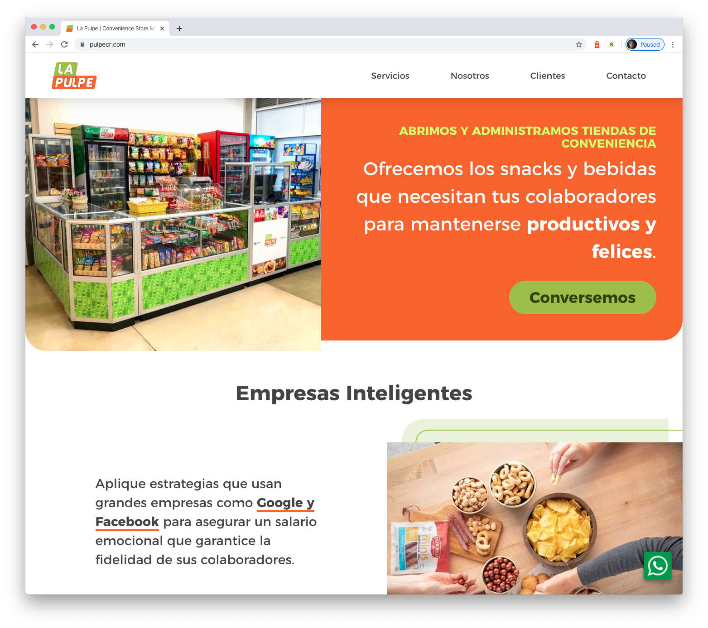
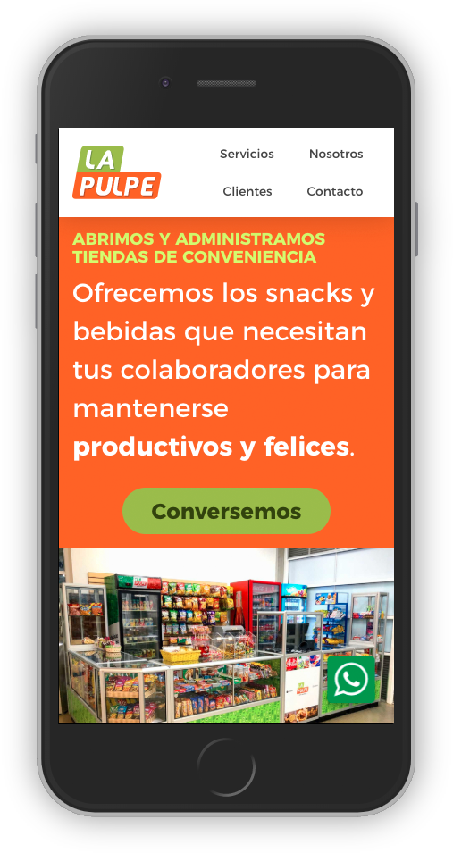
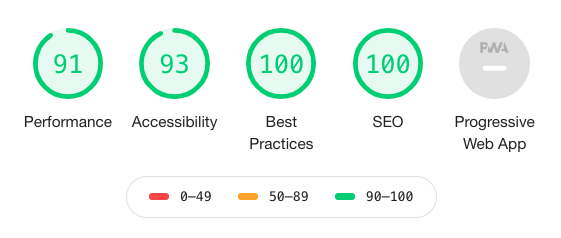

[La Pulpe](https://pulpecr.com) is our family business. We run little convenience store inside companies in Costa Rica.

The old site didn't have any information, just the last 10 post in our Instagram account, we need more than that because in 2020 one of our goals is to open at least one more store.

### Challenge
We are not the typical convenience store, we are focus in a very specific target. So our main goal is that our visitor understand what we do as fast as possible.

### Solution

#### Performance
We need the page to load as fast a possible. Gatsby is a excelent option for static web sites. 

#### Fast deploy
I was able to develop and deploy this site in about 24h of work. Thanks to [Netlify](https://www.netlify.com/) ;)

#### Contact information
We need a form for our users can submit information, we use [Formspark](https://formspark.io/) API which works like a charm and don't have to worry about any backend.

### Benefits
1. Easy to scale
2. Nice way to handle images
3. Modern UI
4. Easy to update and deploy

### Results
Now we have a pretty short and nice website that we can submit to potential clients and we're working on improve our positioning in search engines.

### Next Steps
1. Multilanguage
2. Add some products
3. Add social media links
4. Add more services